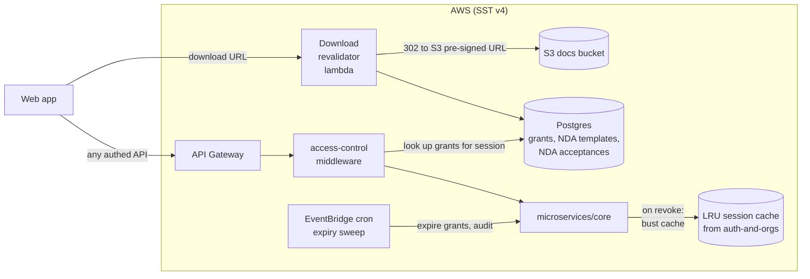

# Design — ai-data-room / access-control

**Status:** draft
**Requirements:** [./requirements.md](./requirements.md)
**Last updated:** 2026-04-21
**Depends on:** `auth-and-orgs`, `room-and-folders`

## Summary

Delivers **two things**: (1) a **grant model + lifecycle** for
external users (invite → NDA acceptance → active → revoked/expired);
(2) an **enforcement layer** — middleware + a signed-URL revalidator
— that gates every API endpoint and download URL in the product.
Internal-user visibility is implicit from `org_memberships` (from
`auth-and-orgs`); external-user visibility is explicit via rows in
this slice. Expiry is handled by a scheduled job. Revocation
propagates within 60s via a session-cache bust + a URL-validator
that re-checks grant state on every download.

## Architecture



### What's shared vs. slice-local

- **Grants** reuse the `external_access_grants` table introduced by
  `auth-and-orgs` (which was forward-compat for this slice). We add
  columns: `permission_tier`, `expires_at`, `status` extended, and
  `nda_acceptance_id`.
- **Middleware** lives in `microservices/core/middleware/` alongside
  the session middleware from `auth-and-orgs`.
- **Download revalidator** is a new tiny lambda — the only reason
  it's separate is latency (it runs ahead of S3, not in the main API
  handler chain).

## Data model

### Extend `external_access_grants`

Columns added to the existing table (migration in this slice):

| Column              | Type                                                          | Notes                                                                     |
| ------------------- | ------------------------------------------------------------- | ------------------------------------------------------------------------- |
| `permission_tier`   | `enum('viewer','downloader')`                                 | For external users only; internal tier is derived from role.              |
| `expires_at`        | `timestamptz`                                                 | Not null for external grants. 30d default, 1–180d range.                  |
| `status`            | `enum('pending_nda','active','revoked','expired')` (extended) | Was `active/revoked` in auth-and-orgs v0.1; add `pending_nda`, `expired`. |
| `nda_template_id`   | `uuid` nullable FK `nda_templates.id`                         | Which NDA version this grant was bound to at acceptance.                  |
| `nda_acceptance_id` | `uuid` nullable FK `nda_acceptances.id`                       | Record of acceptance.                                                     |
| `revoked_at`        | `timestamptz` nullable                                        |                                                                           |
| `revoked_by`        | `uuid` nullable FK `users.id`                                 |                                                                           |

Existing columns (`org_id`, `user_id`, `opportunity_slug`,
`granted_by`) stay. `opportunity_slug` will be migrated to
`opportunity_id` FK when that table exists (see T-003 in this
slice's tasks.md).

### `nda_templates`

Immutable once referenced. Edits create a new version.

| Column          | Type          | Notes                                                                                                          |
| --------------- | ------------- | -------------------------------------------------------------------------------------------------------------- |
| `id`            | `uuid` PK     |                                                                                                                |
| `org_id`        | `uuid` FK     |                                                                                                                |
| `version`       | `int`         | Monotonic per org, starts at 1.                                                                                |
| `body_markdown` | `text`        | Plaintext/markdown (FR7).                                                                                      |
| `fields_schema` | `jsonb`       | Shape of inline fields we let admins edit (e.g. `{ company_name, counterparty_name, effective_date_format }`). |
| `sha256`        | `bytea`       | Hash of the rendered-with-defaults body; referenced in acceptance records.                                     |
| `created_by`    | `uuid` FK     |                                                                                                                |
| `created_at`    | `timestamptz` |                                                                                                                |
| `is_current`    | `boolean`     | One row per org with `true`; trigger-enforced uniqueness.                                                      |

Unique: `(org_id, version)`. Unique partial: `(org_id) where is_current`.

### `nda_acceptances`

Append-only record of an NDA acceptance.

| Column            | Type                                  | Notes                                                      |
| ----------------- | ------------------------------------- | ---------------------------------------------------------- |
| `id`              | `uuid` PK                             |                                                            |
| `org_id`          | `uuid` FK                             |                                                            |
| `template_id`     | `uuid` FK `nda_templates.id`          |                                                            |
| `template_sha256` | `bytea`                               | Copy at acceptance time — detect tampering.                |
| `user_id`         | `uuid` FK                             |                                                            |
| `grant_id`        | `uuid` FK `external_access_grants.id` |                                                            |
| `rendered_body`   | `text`                                | The exact text the user agreed to (with fields filled in). |
| `accepted_at`     | `timestamptz`                         |                                                            |
| `source_ip`       | `inet`                                |                                                            |
| `user_agent`      | `text`                                |                                                            |

### `internal_exclusions`

Targeted exception for internal users excluded from a specific
Opportunity (FR10).

| Column           | Type          | Notes |
| ---------------- | ------------- | ----- |
| `id`             | `uuid` PK     |       |
| `org_id`         | `uuid` FK     |       |
| `user_id`        | `uuid` FK     |       |
| `opportunity_id` | `uuid` FK     |       |
| `excluded_by`    | `uuid` FK     |       |
| `created_at`     | `timestamptz` |       |

Unique: `(org_id, user_id, opportunity_id)`.

## Enforcement — middleware design

```ts
type SessionContext = {
  userId: string;
  orgId: string | null;      // null for external users
  role: Role;                 // 'owner'|'admin'|'internal'|'external'
  opportunityGrants: Array<{
    opportunityId: string;
    permissionTier: 'viewer' | 'downloader';
    grantId: string;
    expiresAt: string;
    status: 'active';
  }>;
  internalExclusions: string[]; // opportunityIds — internal users only
};

type ResourceTarget =
  | { kind: 'org'; orgId: string }
  | { kind: 'canonical-folder'; orgId: string; folder: CanonicalFolder }
  | { kind: 'opportunity'; orgId: string; opportunityId: string }
  | { kind: 'document'; orgId: string; documentId: string; folder: FolderPath };

type Capability = 'view' | 'download' | 'upload' | 'manage';

function authorize(
  session: SessionContext,
  target: ResourceTarget,
  capability: Capability
): AuthorizationResult { ... }
```

### Authorisation matrix

| Role / tier                  | view canonical | download canonical | upload canonical | view opportunity     | download opp.        | upload opp.          | manage |
| ---------------------------- | -------------- | ------------------ | ---------------- | -------------------- | -------------------- | -------------------- | ------ |
| owner / admin                | ✅             | ✅                 | ✅               | ✅                   | ✅                   | ✅                   | ✅     |
| internal                     | ✅             | ✅                 | ✅               | ✅ (unless excluded) | ✅ (unless excluded) | ✅ (unless excluded) | ❌     |
| external — `viewer` tier     | ❌             | ❌                 | ❌               | ✅ (only granted)    | ❌                   | ❌                   | ❌     |
| external — `downloader` tier | ❌             | ❌                 | ❌               | ✅ (only granted)    | ✅ (only granted)    | ❌                   | ❌     |

### Denial responses

- Internal user hitting something they can't do → `403`.
- External user hitting something outside their grant scope → `404`
  (absence-as-denial, per NFR2). The canonical-folder resources are
  always 404 for external users.

## NDA acceptance flow

```
External user                  API                         DB
  │                              │                           │
  │ GET /opportunities/:id       │                           │
  ├─────────────────────────────►│                           │
  │                              │ grant.status=pending_nda  │
  │◄───{ requiresNda: true,──────│                           │
  │     template: {...} }        │                           │
  │                              │                           │
  │ POST /opportunities/:id/nda  │                           │
  │   (rendered_body)            │                           │
  ├─────────────────────────────►│ verify template.sha256    │
  │                              │ create nda_acceptances    │
  │                              │ grant.status='active'     │
  │                              │ grant.nda_acceptance_id   │
  │                              │ audit event               │
  │◄────ok──────────────────────│                           │
```

**Template tamper-proofing**: the rendered body the client POSTs is
recomputed server-side from `(template_id, fields)` and hashed. The
client's rendered body is stored verbatim (for non-repudiation) but
must match the server computation — if it doesn't, reject.

## Download revalidator

The download pipeline's pre-signed URLs from `room-and-folders` are
fronted by a thin lambda that:

1. Parses a short-lived claim token the API added to the URL:
   `?t=<base64url JWT>` — payload `{ grantId, documentId, userId,
exp (≤5min) }`, signed with a cookie-signing-key equivalent.
2. Verifies signature + freshness.
3. Re-reads the grant from DB (≤5ms); rejects if not `active` or
   `expires_at` passed.
4. Re-reads `internal_exclusions`; rejects if present for this
   `(user, opportunity)`.
5. 302-redirects to the S3 pre-signed URL.

**Why not put this inside the API handler?** A pre-signed URL is
served directly by S3 after it's issued — once the URL is handed to
the client, the API is out of the loop. We must intercept the
redemption moment; the revalidator does that. Its cost is a single
DB read per download (hot-cached by Postgres; ≤5ms).

**Why 60s revocation SLA (FR12) despite 5-min URL TTL?** Because the
revalidator checks grant status per click. A URL can live 5 minutes
but click 61s after revoke → revalidator denies. User perceives
≤60s effective revocation.

## Expiry scheduler

EventBridge cron every **10 minutes** runs a lambda:

```ts
UPDATE external_access_grants
SET status = 'expired'
WHERE status = 'active'
  AND expires_at < now();

-- For each newly expired grant, write an audit event.
```

Audit emission uses the `recordAuditEvent` utility from
`auth-and-orgs`. Idempotency (NFR3) is ensured because only rows in
`active` state with past `expires_at` are picked; a row transitioned
on iteration N is invisible to iteration N+1.

## Interfaces

All paths under `/orgs/:orgId/` except NDA acceptance which is under
`/opportunities/:id/nda` for external users who have no org context.

| Method   | Path                                   | Purpose                                                                |
| -------- | -------------------------------------- | ---------------------------------------------------------------------- |
| `POST`   | `/orgs/:orgId/grants`                  | Create external grant (invite). Extends `auth-and-orgs`'s invite flow. |
| `GET`    | `/orgs/:orgId/grants`                  | List grants, filters from FR16.                                        |
| `DELETE` | `/orgs/:orgId/grants/:id`              | Revoke.                                                                |
| `PATCH`  | `/orgs/:orgId/grants/:id`              | Edit (expiry, tier).                                                   |
| `POST`   | `/orgs/:orgId/internal-exclusions`     | Add exclusion.                                                         |
| `DELETE` | `/orgs/:orgId/internal-exclusions/:id` | Remove.                                                                |
| `GET`    | `/orgs/:orgId/nda-template`            | Fetch current.                                                         |
| `PUT`    | `/orgs/:orgId/nda-template`            | Replace (creates new version).                                         |
| `GET`    | `/opportunities/:id/nda`               | External user fetches NDA + required fields.                           |
| `POST`   | `/opportunities/:id/nda`               | External user posts acceptance.                                        |
| `GET`    | `/download/:documentId`                | Front-door for download — runs the revalidator.                        |

## Key trade-offs

- **Grant table reuse vs. new `access_grants` table** — chose reuse
  because `auth-and-orgs` already wrote the row on invite acceptance;
  splitting the table would add a join on every enforcement check.
  Cost: one migration touches an existing table. → [ADR-004](../../../adr/004-access-grant-table-extension.md) _(to be drafted)_

- **Middleware enforcement vs. in-handler checks** — chose middleware
  because it's the only way to be sure no handler forgets to check.
  Handlers declare the `(target, capability)` they require via a
  decorator / wrapper; the middleware evaluates it. → [ADR-005](../../../adr/005-authorization-middleware.md) _(to be drafted)_

- **Download revalidator lambda vs. short-TTL only** — chose
  revalidator. 5-min URL TTL alone gives 5-min-window attack surface
  on revocation; a revalidator gives us sub-minute with negligible
  cost. Worth the one extra lambda.

- **NDA template is plaintext/markdown vs. PDF** — chose
  plaintext/markdown (matches FR7 open question's leaning) because
  rendering edge cases on PDF templates have eaten weeks on other
  projects; MVP doesn't need PDF. PDF acceptance is a Phase 2
  upgrade path (DocuSign integration is the same API shape).

- **Absence-as-denial (404) for external users** — chose this over
  403 because FR11 + NFR2 require not leaking the existence of
  resources. 403 for internal users because internal users already
  know the room exists; it's not information.

## Security

### Threat model (this slice)

| Threat                                                   | Mitigation                                                                                                                       |
| -------------------------------------------------------- | -------------------------------------------------------------------------------------------------------------------------------- |
| Revoked grant still usable via prior session / URL       | 60s cache bust + download revalidator reads grant status on every URL click                                                      |
| NDA template swapped after acceptance                    | Templates are immutable once referenced; acceptances bind a template_id + sha256                                                 |
| External user probing for other Opportunities' existence | Absence-as-denial (404)                                                                                                          |
| Privilege escalation via IDOR on grant edit              | Handler verifies `grant.org_id === session.orgId` before allowing edit; integration test per endpoint                            |
| Token replay on NDA acceptance                           | Acceptance record includes IP + UA + timestamp; same grant cannot be accepted twice (unique partial index)                       |
| Expired grants acting on a stale middleware cache        | Cache TTL 60s + revalidator reads DB on download                                                                                 |
| Malicious NDA body injection (XSS if rendered unsafely)  | NDA body is rendered through a safe markdown renderer with allow-list; never eval'd; never rendered as HTML without sanitisation |

### Secrets

- Revalidator signing key → Secrets Manager, dedicated key (rotateable
  without affecting main session cookies).

### Data

- `rendered_body` in `nda_acceptances` is the source of truth for
  what the user agreed to; never editable post-acceptance; retained
  indefinitely.

## Observability

Logs:

- Every authorisation decision with `userId`, `orgId`, `target.kind`,
  `capability`, `outcome`, `grantId`. Rate-limited to avoid log
  flood (sampled at 10% on successful reads; 100% on denials and
  writes).

Metrics:

- `ac.authz.decision` with dimensions `outcome`, `role`, `capability`
  — count.
- `ac.grant.created` / `revoked` / `expired` — count.
- `ac.nda.accepted` — count.
- `ac.download.revalidator.allow` / `deny` — count.
- `ac.grant.expiring_in_7d` — gauge (scheduled count).
- `ac.grant.expiry_sweep.duration` — histogram.

Alerts:

- Denial rate spike on a single external user — investigate
  (possible probe).
- Revalidator deny rate > 1% sustained — something's wrong with
  grant state sync.
- Expiry sweep failures — page.

## Rollout

Migration: extend `external_access_grants` in one transaction; create
`nda_templates`, `nda_acceptances`, `internal_exclusions`. No
backfill at v0.1 (no production external grants exist yet).

Feature flag: `access_control_enforcement_enabled` per-env — off in
dev initially while we wire handlers, flipped on before staging tests.
Removed before prod.

Deployment order:

1. Migrations.
2. Application layer + middleware (inactive without flag).
3. Handlers + revalidator lambda.
4. Enable flag in staging → run full e2e.
5. Enable in prod alongside v0.3 tag.

Rollback:

- Flag off → middleware allows everything per `role` defaults from
  `auth-and-orgs` only (degraded security but functional).
- Migrations reversible per drizzle convention.

## Open questions

- Cache invalidation strategy for `internal_exclusions` — same 60s
  LRU as sessions? Leaning **yes**, same TTL, same bust path.
- Downloader-tier revalidator also on **list** endpoints? Leaning
  **no** — list is cheap and always goes through middleware; only
  downloads bypass middleware (because the URL lives on the client).
- Grant edit vs. revoke-and-reinvite — which is the primary UX?
  Leaning **edit for tier + expiry only**; re-invite for role kind
  change or email change.

## Sign-off

- [ ] Bradley reviewed
- [ ] Tasks phase unblocked
