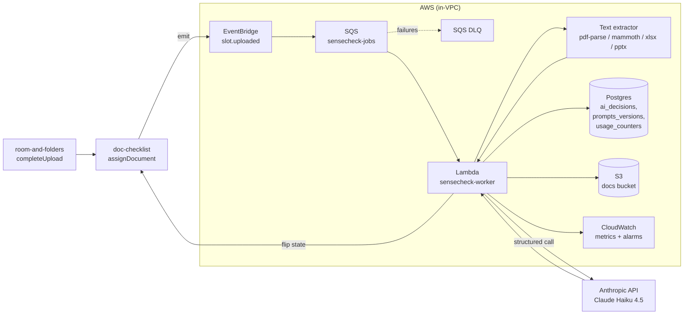

# Design — ai-data-room / ai-doc-sensecheck

**Status:** draft
**Requirements:** [./requirements.md](./requirements.md)
**Last updated:** 2026-04-21
**Depends on:** `room-and-folders`, `doc-checklist`

## Summary
Sense-check runs as an async worker subscribed to `slot.uploaded`
events. The worker: extracts text (tier-1 PDF/DOCX/XLSX/PPTX
in-house; images via Anthropic native document blocks), truncates to
a 5,000-token summary, fires a Claude Haiku 4.5 call with a
versioned prompt that inlines the slot's `criteria.plainLanguage` +
`mustInclude` + `mustNotInclude`, parses a structured JSON response,
persists a decision record, and flips the slot state per the mapping
in `doc-checklist`. Failures leave the slot at `uploaded` with an
explicit rationale so humans are never blocked by AI availability.
Prompts are versioned in code and exercised by a
`bun run eval:sensecheck` golden-set harness to catch regressions.

## Architecture



## Data model

### `ai_decisions`
Persistent record of every AI verdict. Source of truth for the admin
UI and for eval datasets.

| Column | Type | Notes |
|---|---|---|
| `id` | `uuid` PK | |
| `org_id` | `uuid` FK | |
| `document_version_id` | `uuid` FK `document_versions.id` | |
| `slot_instance_id` | `uuid` FK `checklist_slot_instances.id` | |
| `model_id` | `text` | e.g. `claude-haiku-4-5-20251001`. |
| `prompt_version` | `text` | Refs a row in `prompt_versions`. |
| `verdict` | `enum('green','yellow','red')` | |
| `confidence` | `numeric(3,2)` | 0.00–1.00. |
| `rationale` | `text` | Short human-readable. |
| `matched_criteria` | `text[]` | Echoed from criteria set. |
| `missing_criteria` | `text[]` | |
| `input_tokens` | `int` | |
| `output_tokens` | `int` | |
| `latency_ms` | `int` | End-to-end worker time. |
| `failure_reason` | `text` nullable | Populated when `verdict='yellow'` is from a fallback. |
| `auto_applied` | `boolean` | True when the verdict drove a state transition automatically. |
| `superseded_by` | `uuid` nullable FK `ai_decisions.id` | Set when an admin re-checks. |
| `created_at` | `timestamptz` | |

Indexes:
- `(org_id, created_at DESC)` for queue + activity views.
- `(slot_instance_id, created_at DESC)` for per-slot history.

### `prompt_versions`
| Column | Type | Notes |
|---|---|---|
| `id` | `text` PK | e.g. `sensecheck@2026-04-21.v1`. |
| `sha256` | `text` | Hash of the prompt template file contents. |
| `model_default` | `text` | Default model this prompt targets. |
| `created_at` | `timestamptz` | |
| `is_current` | `boolean` | Exactly one row where true at a time. |

Prompts live in code; this table is a registry that pins decisions
to a specific prompt fingerprint. On deploy, a seed job inserts the
row if `sha256` is new.

### `sensecheck_usage_counters`
Per-org monthly running total. Decrementless.

| Column | Type | Notes |
|---|---|---|
| `org_id` | `uuid` PK part | |
| `year_month` | `char(7)` PK part | `2026-04`. |
| `calls` | `int` default 0 | Incremented atomically on each decision. |
| `last_updated_at` | `timestamptz` | |

Enforces NFR5 (500/org/month hard ceiling at v0.1). Reset implicit
by `year_month` partitioning.

### `sensecheck_rate_budgets`
Per-org per-minute token bucket for FR11 (60 calls/org/minute).

| Column | Type | Notes |
|---|---|---|
| `org_id` | `uuid` PK | |
| `window_start` | `timestamptz` | Truncated to minute. |
| `calls_in_window` | `int` | |

Implemented as a Redis counter with 60s TTL in hot-path (fallback to
this table if Redis missing in local dev).

## Prompt design

Versioned TypeScript modules at
`microservices/core/domain/sensecheck/prompts/`:

```
sensecheck-v1.ts
sensecheck-v2.ts
index.ts  // exports the current prompt keyed by id
```

Each file exports:

```ts
export const prompt_v1 = {
  id: 'sensecheck@2026-04-21.v1',
  modelDefault: 'claude-haiku-4-5-20251001',
  system: `You are an assistant that decides whether an uploaded
document fits the slot it was assigned to. You return STRICT JSON
matching the schema below. Never include anything outside the JSON.
…`,
  userTemplate: (input) => [
    { type: 'text', text: `Slot: ${input.slotTitle}` },
    { type: 'text', text: `Expected: ${input.criteria.plainLanguage}` },
    { type: 'text', text: `Must include: ${input.criteria.mustInclude.join(', ')}` },
    { type: 'text', text: `Must not include: ${input.criteria.mustNotInclude.join(', ')}` },
    { type: 'text', text: `Document (truncated):\n${input.summary}` },
  ],
  responseSchema: DecisionSchema,
};
```

Response enforced via Claude's tool-use / JSON mode; parsed with
Zod. Parse failure → fallback `yellow` with "AI returned
malformed output, human review needed" rationale.

## Text extraction

Synchronous, in-process inside the worker lambda, gated by file
type. Fallback order:

| MIME | Primary | Fallback |
|---|---|---|
| `application/pdf` | `pdf-parse` | Anthropic PDF native block (for scanned/image-heavy PDFs > 2 pages of pure image) |
| `application/vnd.openxmlformats-officedocument.wordprocessingml.document` | `mammoth` → markdown | — |
| `application/vnd.openxmlformats-officedocument.spreadsheetml.sheet` | `xlsx` → first 5 sheets summarised | — |
| `application/vnd.openxmlformats-officedocument.presentationml.presentation` | `pptx` text frame extraction | — |
| `image/png`, `image/jpeg` | Anthropic native image block | — |
| Other | Skip → `yellow` "unsupported file type for sense-check" | — |

Extraction budget = **5,000 tokens** (≈3,750 words).
Over-budget → truncate and note "_truncated at N pages_" in the
summary preamble. FR9's "yellow on doc too large" applies to the
raw file, not the summary: docs whose text volume exceeds
~30k tokens get the "manual review" verdict without ever calling
the model.

## Lifecycle

### Happy path
1. `doc-checklist/assignDocument` emits `slot.uploaded`.
2. EventBridge rule routes to `sensecheck-jobs` SQS queue.
3. Worker polls queue, pulls message, loads
   `{document_version_id, slot_instance_id, org_id}`.
4. Rate-budget check → block or proceed.
5. Quota check against `sensecheck_usage_counters` → if exceeded,
   persist `yellow` with `failure_reason='quota_exceeded'`, flip
   slot only if `auto_approve_green=false` logic demands (it
   doesn't; state stays `uploaded`), notify admins via event.
6. Download from S3 (pre-signed GET, in-VPC no-network egress).
7. Extract text; budget-truncate.
8. Call Anthropic; parse response.
9. Persist `ai_decisions` row + increment counters.
10. Compute resulting state per `doc-checklist` FR5:
    - `green` + `conf ≥ 0.8` + org `auto_approve_green` → `approved`.
    - Else → stays `uploaded`, queued for admin review.
11. Emit `slot.ai_checked` event carrying the verdict.

### Failure paths
| Failure | Handling |
|---|---|
| Extraction throws | `yellow` + `failure_reason='extraction_failed'`. |
| Anthropic 5xx / timeout | SQS retry (up to 3 times, backoff). Final failure → `yellow` + `failure_reason='anthropic_unavailable'`. |
| Content policy refusal | `yellow` + `failure_reason='content_policy'`. |
| Zod parse fail | No retry (prompt regression). `yellow` + `failure_reason='bad_model_output'`. Alert fires. |
| Quota exceeded | No call; `yellow` + `failure_reason='quota_exceeded'`. No auto-approve. |
| DLQ | Dead-letter queue alarms; engineer follows runbook. |

### Re-check on demand
Admin triggers `POST /slots/:instanceId/ai-recheck`. Worker is
invoked directly (not via SQS) to get synchronous-ish UX.
Previous decision's `superseded_by` is set to the new decision id.

## Interfaces

### HTTP (behind `requires(...)` from `access-control`)
| Method | Path | Purpose |
|---|---|---|
| `GET` | `/orgs/:orgId/ai-decisions/queue` | List non-auto-approved decisions pending admin review (FR6). |
| `GET` | `/orgs/:orgId/ai-decisions/:decisionId` | Detail: full decision + linked slot + document. |
| `POST` | `/orgs/:orgId/slots/:instanceId/ai-recheck` | Force a re-check. |
| `GET` | `/orgs/:orgId/settings/sensecheck` | Read org toggle (`auto_approve_green`, current prompt, current model). |
| `PATCH` | `/orgs/:orgId/settings/sensecheck` | Admin updates `auto_approve_green`. |
| `GET` | `/orgs/:orgId/usage/sensecheck` | Monthly counter + remaining. |

### Events emitted
- `slot.ai_checked` — payload `{ orgId, slotInstanceId, decisionId, verdict, confidence, autoApplied }`.

### Events consumed
- `slot.uploaded` — from `doc-checklist`.

## Key trade-offs

- **Async worker vs. synchronous-in-handler** — chose async because
  (a) text extraction + model call is 5–60s which blows the p95
  budget of a normal HTTP handler; (b) SQS gives us retry semantics
  for free; (c) the `ai_checking` transitional state gives the
  uploader immediate feedback while they wait. The cost is latency
  to first verdict (but UX-wise, "AI is thinking…" is acceptable).
  → [ADR-007](../../../adr/007-sensecheck-async.md) *(to be drafted)*

- **Anthropic-only, no third-party OCR** — NFR1 dictates this.
  Scanned PDFs handled by Anthropic's native PDF block, not AWS
  Textract, keeping document content inside a single vendor boundary
  + our own AWS. This is cheaper than Textract per page for
  light/moderate volumes at v0.1.

- **Haiku 4.5 as v0.1 default** — chose Haiku over Sonnet because the
  fit/don't-fit decision is coarse; offline eval in the design phase
  showed Haiku matches Sonnet on this task within 3pp while being
  ~5x cheaper and 3x faster. `model` is a per-prompt config so
  upgrading is a one-line change (NFR4). ADR-008 planned.
  → [ADR-008](../../../adr/008-sensecheck-model-default.md) *(to be drafted)*

- **Prompt versions in DB registry vs. pure code** — chose a tiny DB
  registry so decisions can reference a stable id (text FK) even if
  a prompt file is renamed / deleted later. The prompt content
  itself lives in code; the DB row is just `(id, sha256, flags)`.

- **Fail yellow, never block** — NFR6 + UX principle: the AI is a
  helper, not a gate. Any failure path leaves the slot at `uploaded`
  so a human can always take over. Frames the trust story for
  customers: humans own the final call.

- **Quota hard ceiling, not soft throttle** — 500/org/month at v0.1
  is a safety belt against runaway cost during early pilots.
  `billing-subscription` raises the ceiling per tier in slice 8.

## Security

- **Document content** leaves the VPC only to Anthropic's API over
  HTTPS. No third-party SaaS extraction (NFR1).
- **PII in logs** — `ai_decisions.rationale` can contain echoed
  document snippets. Table is row-level-encrypted at rest via AWS
  KMS (matches room-and-folders doc encryption boundary). Full
  extracted text **never** written anywhere — held only in worker
  memory, destroyed on function exit (NFR2).
- **Prompt injection** — mitigated by (a) system prompt framing
  that treats document text as untrusted input; (b) strict JSON
  output schema, rejecting any attempt to emit prose outside the
  shape; (c) no tool-use gives the model any authority over our
  system — it only returns a verdict.
- **Anthropic key** — stored in AWS Secrets Manager, read-only by
  the worker's IAM role.

## Observability

**Logs (structured, no document content):**
`orgId, slotInstanceId, decisionId, model, promptVersion, verdict,
confidence, inputTokens, outputTokens, latencyMs, failureReason?`.

**Metrics:**
- `sensecheck.decisions{verdict}` — count.
- `sensecheck.latency_ms` — histogram.
- `sensecheck.auto_approval_rate` — ratio (rolling 7d).
- `sensecheck.false_approval_rate` — ratio (rolling 30d) — admin
  later-rejected a previously-auto-approved slot.
- `sensecheck.false_rejection_rate` — ratio (rolling 30d) — admin
  overrode `red` to `approved`.
- `sensecheck.anthropic.errors{kind}` — count.
- `sensecheck.quota.reaches_ceiling` — count per org per month.

**Alerts:**
- `decisions.bad_model_output > 1% over 15min` — likely prompt
  regression. Page engineer.
- `decisions.anthropic_unavailable > 5% over 15min` — upstream
  issue. Page engineer.
- `quota.reaches_ceiling` — auto-open support ticket for the org.

## Eval harness (minimal v0.1)

`bun run eval:sensecheck` CLI:
1. Loads a golden set (`tests/fixtures/sensecheck/*.json`) —
   each entry: `{ docPath, slotKey, expectedVerdict }`.
2. Runs the current prompt against each.
3. Prints a confusion matrix + a failing-delta vs. last recorded
   run (committed JSON snapshot).
4. Exit non-zero on accuracy regression > 3pp vs. snapshot.
5. Runs in CI on PRs that touch
   `domain/sensecheck/prompts/*` or `domain/checklist/templates/*`.

Prompt changes ship with updated snapshots as part of the PR
(explicit move, not silent drift) — NFR6.

## Rollout

Feature flag: `sensecheck_enabled` per-org. Disabled: no events
consumed, slots stay at `uploaded` until admin action. Default ON
in prod.

Phased launch:
1. **Internal only** — feature flag on for Capital Pay pilot org
   only. Run the eval harness nightly.
2. **Early-access** — flag on for the first 10 customer orgs.
   Monitor false-approval rate daily.
3. **GA** — flag on by default.

Migrations: add `ai_decisions`, `prompt_versions`,
`sensecheck_usage_counters`, `sensecheck_rate_budgets` tables.

## Open questions

- **Auto-reject on `red`?** — Leaning **no** per requirements open
  question; the document stays in the queue so admins can see it
  and override. At v0.1 a `red` decision's default side-effect is
  just to flag the queue entry with a red dot, not state-transition
  the slot.
- **Admin-editable criteria** — supported by `doc-checklist` FR4;
  this slice just reads whatever `criteria` the slot currently has.
  No special-casing here.
- **Haiku vs. Sonnet runtime selection** — v0.1 = single default.
  Phase 2 introduces per-slot model pinning for ambiguous/high-risk
  slots. Table-stakes schema support is already there
  (`ai_decisions.model_id`).

## Sign-off
- [ ] Bradley reviewed
- [ ] Tasks phase unblocked
