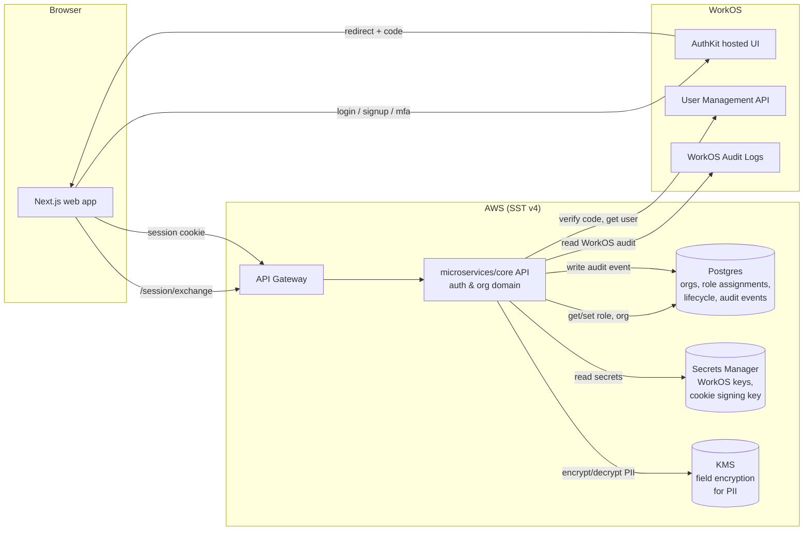

# Design — ai-data-room / auth-and-orgs

**Status:** draft
**Requirements:** [./requirements.md](./requirements.md)
**Last updated:** 2026-04-21

## Summary

Delegate identity, MFA, session issuance, and transactional auth email to
**WorkOS** (via AuthKit hosted flows). Own the domain model for **orgs**,
**role assignments**, **Opportunity-scoped external access**, **user
lifecycle state** (active / suspended / deleted), and a structured **audit
trail**. The slice ships as a new microservice inside an SST v4 monorepo
scaffolded from `sst-monorepo-template`, following the same layered
architecture (domain / application / infrastructure / handlers) and the
same WorkOS integration pattern already proven in
`funds-distribution-platform`.

## Architecture



### Boundary: what WorkOS owns vs. what we own

| Concern                                                                   | Owned by WorkOS        | Owned by us                                          |
| ------------------------------------------------------------------------- | ---------------------- | ---------------------------------------------------- |
| User identity (email, password, MFA device, TOTP secret, WebAuthn future) | ✅                     |                                                      |
| Email verification flow + email delivery                                  | ✅                     |                                                      |
| Invite token issuance + invite email delivery                             | ✅                     |                                                      |
| Password reset flow + email delivery                                      | ✅                     |                                                      |
| MFA enrolment UI + TOTP verification                                      | ✅                     |                                                      |
| Session token issuance + refresh                                          | ✅                     |                                                      |
| Org concept (as a WorkOS "Organization")                                  | ✅ (thin)              | ✅ (our domain org wraps it)                         |
| Role assignment to users (`owner`/`admin`/`internal`/`external`)          |                        | ✅                                                   |
| Opportunity scope on an external invite                                   |                        | ✅                                                   |
| User lifecycle state (`active`/`suspended`/`deleted`)                     |                        | ✅                                                   |
| Product audit trail (queryable per-org, per-user, per-time range)         | WorkOS emits its own   | ✅ (ours is the system of record for product events) |
| Session revocation on suspension / password reset                         | Trigger via WorkOS SDK | ✅ (our suspension flow calls it)                    |

We treat WorkOS as the **identity substrate**, not the product's domain
model. Our DB is the system of record for anything business-specific.

## Data model

Relational (Postgres via PlanetScale for v0.1, matching the default stack).
All tables carry `created_at`, `updated_at`; user-created data carries
`created_by` where meaningful.

### `organizations`

| Column                      | Type                                   | Notes                                                       |
| --------------------------- | -------------------------------------- | ----------------------------------------------------------- |
| `id`                        | `uuid` PK                              | Our id; 1:1 with a WorkOS Organization.                     |
| `workos_org_id`             | `text` unique                          | FK to WorkOS.                                               |
| `name`                      | `text`                                 | Display name.                                               |
| `slug`                      | `text` unique                          | URL-safe handle.                                            |
| `status`                    | `enum('active','suspended','deleted')` | Org-level lifecycle. v0.1 only `active` used in happy path. |
| `created_at` / `updated_at` | `timestamptz`                          |                                                             |

### `users`

Our mirror of a WorkOS user. We store only what we need to join to domain
tables; authoritative identity fields live in WorkOS.

| Column                      | Type                                   | Notes                                                           |
| --------------------------- | -------------------------------------- | --------------------------------------------------------------- |
| `id`                        | `uuid` PK                              |                                                                 |
| `workos_user_id`            | `text` unique                          | FK to WorkOS.                                                   |
| `email`                     | `citext` unique                        | Mirrored for query convenience; authoritative source is WorkOS. |
| `full_name`                 | `text`                                 |                                                                 |
| `lifecycle_state`           | `enum('active','suspended','deleted')` | See §Requirements FR21–FR23.                                    |
| `email_verified_at`         | `timestamptz` nullable                 | Mirrored from WorkOS.                                           |
| `mfa_enrolled_at`           | `timestamptz` nullable                 | Mirrored from WorkOS.                                           |
| `created_at` / `updated_at` | `timestamptz`                          |                                                                 |

On `lifecycle_state = 'deleted'`: PII columns (`email`, `full_name`) are
nulled; `workos_user_id` retained as a tombstone so audit rows remain
joinable.

### `org_memberships`

Join: user ↔ org ↔ role. One row per (user, org) pair. v0.1 constrains a
user to at most one internal membership (enforced at app level).

| Column                      | Type                               | Notes                                      |
| --------------------------- | ---------------------------------- | ------------------------------------------ |
| `id`                        | `uuid` PK                          |                                            |
| `org_id`                    | `uuid` FK `organizations.id`       |                                            |
| `user_id`                   | `uuid` FK `users.id`               |                                            |
| `role`                      | `enum('owner','admin','internal')` | External users don't get a membership row. |
| `created_at` / `updated_at` | `timestamptz`                      |                                            |

Unique: `(org_id, user_id)`. Unique partial: `(org_id) where role='owner'`
enforces single-owner-per-org at v0.1.

### `external_access_grants`

External users don't have an org membership; they have one or more
scoped grants. Enforcement lives in `access-control`; this slice only
records the scope at invite-accept time.

| Column                      | Type                         | Notes                                                                              |
| --------------------------- | ---------------------------- | ---------------------------------------------------------------------------------- |
| `id`                        | `uuid` PK                    |                                                                                    |
| `org_id`                    | `uuid` FK `organizations.id` | Host org.                                                                          |
| `user_id`                   | `uuid` FK `users.id`         |                                                                                    |
| `opportunity_slug`          | `text`                       | E.g., `Vendor_A`. Future FK when Opportunities land in `room-and-folders`.         |
| `granted_by`                | `uuid` FK `users.id`         |                                                                                    |
| `status`                    | `enum('active','revoked')`   | Revocation handled in `access-control` slice; state column here is forward-compat. |
| `created_at` / `updated_at` | `timestamptz`                |                                                                                    |

### `invitations`

We store our own row per invite to carry domain metadata (role or
Opportunity scope) that WorkOS's invitation API doesn't model natively.

| Column                      | Type                                             | Notes                                 |
| --------------------------- | ------------------------------------------------ | ------------------------------------- |
| `id`                        | `uuid` PK                                        |                                       |
| `workos_invitation_id`      | `text` unique                                    | FK to WorkOS.                         |
| `org_id`                    | `uuid` FK                                        |                                       |
| `email`                     | `citext`                                         |                                       |
| `kind`                      | `enum('internal','external')`                    |                                       |
| `role`                      | `enum('admin','internal')` nullable              | Only set when `kind='internal'`.      |
| `opportunity_slug`          | `text` nullable                                  | Only set when `kind='external'`.      |
| `invited_by`                | `uuid` FK `users.id`                             |                                       |
| `state`                     | `enum('pending','accepted','revoked','expired')` |                                       |
| `expires_at`                | `timestamptz`                                    | 7 days from issuance; mirrors WorkOS. |
| `accepted_at`               | `timestamptz` nullable                           |                                       |
| `created_at` / `updated_at` | `timestamptz`                                    |                                       |

### `audit_events`

System of record for FR24. Append-only by convention in v0.1; row-level
immutability via Postgres trigger added when we enter SOC 2 scope (see
NFR10 — we don't need it in v0.1 but the shape must support it).

| Column           | Type                        | Notes                                    |
| ---------------- | --------------------------- | ---------------------------------------- |
| `id`             | `uuid` PK                   |                                          |
| `occurred_at`    | `timestamptz`               | Indexed.                                 |
| `event_type`     | `text`                      | One of the 21 types enumerated in FR24.  |
| `actor_user_id`  | `uuid` nullable             | Null for pre-auth events.                |
| `target_user_id` | `uuid` nullable             |                                          |
| `org_id`         | `uuid` nullable             | Null for pre-auth signup-in-progress.    |
| `source_ip`      | `inet`                      |                                          |
| `user_agent`     | `text`                      |                                          |
| `outcome`        | `enum('success','failure')` |                                          |
| `metadata`       | `jsonb`                     | Event-type-specific payload, no secrets. |

Indexes: `(org_id, occurred_at desc)`, `(actor_user_id, occurred_at desc)`,
`(target_user_id, occurred_at desc)`, `(event_type, occurred_at desc)`.

### `recovery_codes` — **not stored by us**

WorkOS holds MFA secrets and recovery codes. We record audit events for
`mfa_enrolled`, `mfa_removed`, and `recovery_code_used` using WorkOS
webhooks; we never see plaintext codes.

## Interfaces

All routes live under `microservices/core`. API Gateway HTTP API (SST v4
default). Zod schemas in `packages/api-utils/schemas/auth-orgs.ts`.

### Public (unauthenticated)

| Method | Path               | Purpose                                                                                                           |
| ------ | ------------------ | ----------------------------------------------------------------------------------------------------------------- |
| `GET`  | `/auth/login`      | Redirect to WorkOS AuthKit login.                                                                                 |
| `GET`  | `/auth/signup`     | Redirect to WorkOS AuthKit signup.                                                                                |
| `GET`  | `/auth/callback`   | Exchange WorkOS auth code → create/find org + user + membership + session cookie.                                 |
| `POST` | `/auth/logout`     | Invalidate WorkOS session; clear cookie.                                                                          |
| `POST` | `/webhooks/workos` | Receive WorkOS events (verification completed, MFA enrolled, user deleted). Verified via WorkOS signature header. |

### Authenticated

All authenticated routes require a session cookie validated against
WorkOS on every request via middleware (with an in-memory LRU cache
keyed by session token, TTL 60s, to keep p50 latency reasonable).

| Method   | Path                                   | Purpose                                                                                           |
| -------- | -------------------------------------- | ------------------------------------------------------------------------------------------------- |
| `GET`    | `/me`                                  | Returns current user shape (FR14).                                                                |
| `POST`   | `/orgs/:orgId/invitations`             | Create invite (internal or external).                                                             |
| `GET`    | `/orgs/:orgId/invitations`             | List invites for the org.                                                                         |
| `DELETE` | `/orgs/:orgId/invitations/:id`         | Revoke a pending invite.                                                                          |
| `POST`   | `/orgs/:orgId/users/:userId/suspend`   | Suspend a user.                                                                                   |
| `POST`   | `/orgs/:orgId/users/:userId/unsuspend` | Un-suspend.                                                                                       |
| `GET`    | `/orgs/:orgId/audit-events`            | Query audit events (pagination + filters). Minimal shape for v0.1; UI lives in `admin-dashboard`. |

### `GET /me` response shape

```ts
{
  userId: string;
  email: string;
  fullName: string;
  role: 'owner' | 'admin' | 'internal' | 'external';
  orgId: string | null;     // null for pure-external users
  orgName: string | null;
  opportunityScopes: string[]; // populated for external users
  emailVerified: boolean;
  mfaEnrolled: boolean;
  lifecycleState: 'active' | 'suspended' | 'deleted';
}
```

### Audit event canonical shape

```ts
{
  id: string; // uuid
  occurredAt: string; // ISO 8601
  eventType: AuditEventType; // enum of 21 values from FR24
  actorUserId: string | null;
  targetUserId: string | null;
  orgId: string | null;
  sourceIp: string;
  userAgent: string;
  outcome: "success" | "failure";
  metadata: Record<string, unknown>; // no PII beyond email, no tokens
}
```

### WorkOS webhook events we handle

- `user.created`
- `user.updated` (email verification flips `email_verified_at`)
- `user.deleted`
- `authentication.mfa_enrolled`
- `authentication.mfa_challenge_succeeded` → `login_success` audit
- `authentication.mfa_challenge_failed` → `mfa_failure` audit
- `session.created` / `session.revoked`

We treat the webhook as the source of truth for lifecycle events; direct
SDK reads are for synchronous flows only.

## Key trade-offs

- **WorkOS vs. building in-house (Lucia/Auth.js + custom MFA)** — chose
  WorkOS because (a) it gives us SOC 2–ready audit, MFA, and SSO/SAML
  for free; (b) FDP already runs `@workos-inc/node@^8.5.0` so the pattern
  is proven in Bradley's stack; (c) time-to-first-customer matters more
  than the marginal cost at <100 orgs. Accept the lock-in; revisit if we
  exceed WorkOS's pricing elasticity. → [ADR-001](../../../adr/001-workos-as-auth-platform.md) _(to be drafted)_

- **Postgres (PlanetScale) vs. DynamoDB for the domain model** — chose
  Postgres because the access pattern is inherently relational
  (org ↔ membership ↔ user, grants, audit queries by `(orgId, timeRange)`)
  and because the audit store benefits from secondary indexes we'd have
  to reinvent on Dynamo. DynamoDB stays the default for simple KV /
  high-throughput cases elsewhere in the product. → [ADR-002](../../../adr/002-postgres-for-auth-domain.md) _(to be drafted)_

- **Mirror WorkOS user into local `users` table vs. query-through** —
  chose mirror because (a) we want FK joins from `audit_events`,
  `org_memberships`, and `external_access_grants` without cross-system
  lookups; (b) webhooks + a nightly reconciliation job keep drift bounded;
  (c) avoids a WorkOS API call on every authenticated request (the
  session cache only covers session validation). Tradeoff: dual-write
  risk, addressed by treating the webhook as source of truth.

- **Session cache TTL 60s vs. none** — chose a short cache because
  WorkOS session validation on every request would add ~60–100ms p50
  to every API call. 60s is short enough that suspension (which calls
  WorkOS's revoke endpoint) is effective within the FR21 1-minute SLA
  for session termination. Explicit cache bust on our `suspend` handler.

- **Opportunity scope stored as string slug vs. FK now** — string slug
  at v0.1, FK to `opportunities` table when `room-and-folders` lands.
  Keeps this slice from having a false dependency on the next slice.

## Security

### Threat model (top risks for this slice)

| Threat                                       | Mitigation                                                                              |
| -------------------------------------------- | --------------------------------------------------------------------------------------- |
| Credential stuffing / password spray         | WorkOS rate limiting + our own NFR4 limits at API Gateway.                              |
| MFA bypass via auth code replay              | WorkOS handles code single-use; our callback additionally checks state + PKCE.          |
| Invite token brute force                     | WorkOS-issued tokens ≥128 bits; our own DB lookup rate-limited per IP.                  |
| Session hijack via XSS                       | `HttpOnly` + `Secure` + `SameSite=Lax` cookies; no session token ever in JS.            |
| CSRF on state-changing endpoints             | `SameSite=Lax` cookies + double-submit CSRF token on POST/DELETE.                       |
| Insider read of audit events for another org | Handler enforces `req.session.orgId === params.orgId`; integration test per endpoint.   |
| Webhook spoof                                | WorkOS webhook signature verification required on every inbound event; reject unsigned. |
| Lost MFA device → account lockout            | Downloadable recovery codes at enrolment (FR17).                                        |

### Secrets handling

- WorkOS API key, webhook secret, cookie signing key → AWS Secrets
  Manager; referenced in SST via `new sst.Secret()` with rotation-ready
  naming, following FDP's pattern.
- KMS-backed envelope encryption for any PII column we add later
  (e.g. phone if Phase 2 SMS MFA is ever revisited — currently no).

### PII

- Email + name are the only PII in this slice. Stored in Postgres; not
  encrypted at column level in v0.1 because availability for queries
  outweighs the marginal ROI pre-SOC 2. Flagged in `memory/decisions.md`
  for revisit when SOC 2 scope begins.
- GDPR hard-delete (NFR9): implemented as `lifecycle_state='deleted'` +
  PII scrub via a transactional stored procedure. Audit rows keep
  `target_user_id` as the stable tombstone.

### Fintech-specific

Even though ai-data-room isn't directly regulated, Bradley's CTO posture
is to engineer for the stricter bar. We keep the audit trail append-only
in spirit today (no UPDATE/DELETE paths in the application layer) so the
SOC 2 transition doesn't require a data migration.

## Observability

### Logs (structured JSON, pino)

- Every handler logs `{ requestId, userId, orgId, route, status, durationMs }`.
- Auth failures log event type + outcome but never tokens or passwords.

### Metrics (CloudWatch EMF)

- `auth.login.success` / `auth.login.failure` — count.
- `auth.mfa.challenge.success` / `auth.mfa.challenge.failure` — count.
- `auth.invite.sent` / `auth.invite.accepted` / `auth.invite.expired` — count.
- `auth.suspension.applied` / `auth.suspension.revoked` — count.
- `auth.session.validation.latency` — histogram (p50/p95/p99).
- `auth.webhook.workos.received` / `auth.webhook.workos.invalid_signature` — count.

### Traces (AWS X-Ray)

- Trace tags: `orgId`, `userId`, `eventType`. Traces span from API GW →
  handler → WorkOS SDK call → DB.

### Alerts

- Failed-login spike: >3× 1-week baseline over 5 minutes — page on-call.
- MFA-failure spike: same pattern.
- Invalid webhook signatures: >0 over 5 minutes — page on-call (possible
  secret exfil).
- Session validation p95 > 500ms sustained — page.
- Audit event write failures: >0 — page (audit integrity is critical).

## Rollout

### Environments

- `dev` (personal / CI), `staging`, `prod`. Standard SST v4 stages.

### Feature flags

- None for this slice. It's the first slice; the whole product gates on
  its existence. Subsequent slices will feature-flag.

### Migrations

- Postgres migrations via `drizzle-kit` (matching FDP convention).
  Migration order: `organizations` → `users` → `org_memberships` →
  `external_access_grants` → `invitations` → `audit_events`.
- No backfills — this is greenfield.

### Deployment order

1. Secrets provisioned (WorkOS keys, cookie key).
2. DB migrations applied.
3. API deployed.
4. Web deployed.
5. WorkOS webhook URL registered pointing at `/webhooks/workos`.

### Rollback

- Any migration is wrapped in a single transaction and reversible.
- App rollback: `sst deploy` to prior commit.
- Data rollback: migration-reverse scripts kept next to migration files
  (drizzle convention).

### Pre-prod checks (mapped to deploy-checklist skill)

- [ ] All acceptance criteria scripted as Playwright e2e.
- [ ] WorkOS webhook signature test passes against staging key.
- [ ] Rate-limit integration test passes.
- [ ] `/me` returns correct shape for all four roles.
- [ ] Suspension invalidates sessions within 60s in staging.

## Open questions

_(design-phase; none block Bradley's sign-off — flagged for implementation
turn)_

- PlanetScale vs. RDS Postgres — match whatever FDP is on (confirm on
  first repo peek during scaffold).
- Do we co-deploy the `web` package in this slice's PR or wait until
  `room-and-folders`? Leaning: co-deploy a minimal `/me` page to prove
  end-to-end; defer anything richer.
- Audit event retention — v0.1 keep forever; revisit when storage cost
  shows up.
- Do we stand up `@ai-data-room/admin-api` as a separate microservice
  now or keep it inside `core` until `admin-dashboard`? Leaning: keep
  in `core`; split only when a second consumer exists.

## Sign-off

- [ ] Bradley reviewed
- [ ] Tasks phase unblocked
