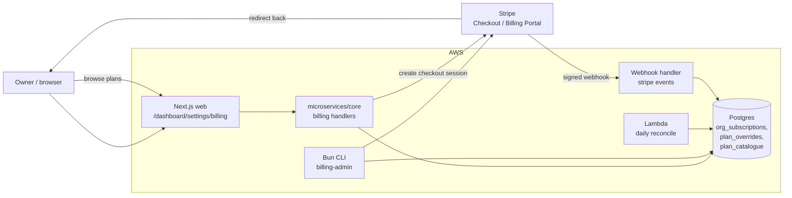

# Design — ai-data-room / billing-subscription

**Status:** draft
**Requirements:** [./requirements.md](./requirements.md)
**Last updated:** 2026-04-21
**Depends on:** `auth-and-orgs`

## Summary

Stripe is the source of truth for cards, subscriptions, and
invoices; we mirror only the **plan state** locally so that limit
checks are sub-10ms (NFR3). A signed Stripe webhook updates our
mirror on subscription lifecycle events. Plan limits are encoded
in code (not Stripe metadata) and enforced via a single
`enforcePlanLimit(orgId, metric)` helper called inline at the
relevant write paths in earlier slices. Bradley-only back-door is
a Bun CLI, not a UI surface (smaller attack surface, ops-friendly).

## Architecture



## Data model

### `org_subscriptions`

Local mirror of Stripe subscription state. One row per org.

| Column                      | Type                                                          | Notes                     |
| --------------------------- | ------------------------------------------------------------- | ------------------------- |
| `org_id`                    | `uuid` PK FK `organizations.id`                               |                           |
| `stripe_customer_id`        | `text`                                                        |                           |
| `stripe_subscription_id`    | `text` nullable                                               | Null while trial-no-card. |
| `plan_id`                   | `text` FK `plan_catalogue.id`                                 |                           |
| `billing_period`            | `enum('monthly')`                                             | v0.1 monthly only.        |
| `status`                    | `enum('trialing','active','past_due','canceled','suspended')` |                           |
| `trial_ends_at`             | `timestamptz` nullable                                        |                           |
| `current_period_start`      | `timestamptz` nullable                                        |                           |
| `current_period_end`        | `timestamptz` nullable                                        |                           |
| `cancel_at_period_end`      | `boolean` default false                                       |                           |
| `created_at` / `updated_at` | `timestamptz`                                                 |                           |

Index: `(status)` for periodic-job sweeps.

### `plan_catalogue`

Code-seeded table; not editable in UI. Mirrors the table in
requirements FR1.

| Column                         | Type            | Notes                                       |
| ------------------------------ | --------------- | ------------------------------------------- |
| `id`                           | `text` PK       | `starter`, `growth`, `scale`, `enterprise`. |
| `name`                         | `text`          | Display name.                               |
| `monthly_price_gbp_pence`      | `int`           |                                             |
| `stripe_price_id`              | `text` nullable | Null for `enterprise`.                      |
| `limit_internal_users`         | `int`           |                                             |
| `limit_active_external_grants` | `int`           |                                             |
| `limit_opportunities`          | `int`           |                                             |
| `limit_sensecheck_per_month`   | `int`           |                                             |
| `limit_qna_per_month`          | `int`           |                                             |
| `is_self_serve`                | `boolean`       | False for `enterprise`.                     |

Seeded by deploy job from a TS module
(`microservices/core/domain/billing/plans.ts`). Limits are read
from this table at enforcement time — Stripe knows nothing about
limits.

### `plan_overrides`

Bradley-set per-org overrides (FR14).

| Column           | Type                                                                                                     | Notes                          |
| ---------------- | -------------------------------------------------------------------------------------------------------- | ------------------------------ |
| `id`             | `uuid` PK                                                                                                |                                |
| `org_id`         | `uuid` FK                                                                                                |                                |
| `metric`         | `enum('internal_users','active_external_grants','opportunities','sensecheck_per_month','qna_per_month')` |                                |
| `override_value` | `int`                                                                                                    |                                |
| `expires_at`     | `timestamptz` nullable                                                                                   |                                |
| `applied_by`     | `uuid` FK `users.id`                                                                                     | Bradley's user id in practice. |
| `reason`         | `text`                                                                                                   |                                |
| `created_at`     | `timestamptz`                                                                                            |                                |

Active overrides shadow plan limits at enforcement time.

### `stripe_webhook_events`

Idempotency log for webhook deliveries (NFR2).

| Column           | Type          | Notes            |
| ---------------- | ------------- | ---------------- |
| `id`             | `text` PK     | Stripe event id. |
| `type`           | `text`        |                  |
| `received_at`    | `timestamptz` |                  |
| `payload_sha256` | `text`        |                  |

Insert with `ON CONFLICT DO NOTHING` to make duplicate delivery a
no-op.

## Limit enforcement

A single helper called inline at write paths:

```ts
async function enforcePlanLimit(
  orgId: string,
  metric: PlanMetric,
  options?: { increment?: number },
): Promise<void> {
  const { current, limit } = await getCurrentAndLimit(orgId, metric);
  if (current + (options?.increment ?? 1) > limit) {
    throw new PlanLimitError({ metric, current, limit, upgradeUrl });
  }
}
```

Hooked into:

- `auth-and-orgs/createInvitation` → `internal_users` (when role
  internal/admin/owner) or `active_external_grants` (when role
  external).
- `room-and-folders/createOpportunity` → `opportunities`.
- `ai-doc-sensecheck/runSenseCheck` → `sensecheck_per_month`.
- `ai-search-qna/ask` → `qna_per_month`.

`PlanLimitError` translates to HTTP 402 with the structured body
in FR13.

`getCurrentAndLimit`:

- Reads usage counters (`sensecheck_usage_counters`,
  `qna_usage_counters`) for monthly metrics.
- Counts `org_memberships`, `external_access_grants`,
  `opportunities` for cap metrics.
- Reads plan limit, then layers any active `plan_overrides` on top.
- LRU-cached for 30s per `(orgId, metric)` to meet NFR3.

## Stripe integration

### Checkout (FR8)

Server creates a Stripe Checkout Session in `subscription` mode
referencing `stripe_price_id` for the chosen plan + the org's
`stripe_customer_id`. Returns the URL for the client to redirect to.
Success URL = `/dashboard/settings/billing?status=success`.

### Billing Portal (FR9, FR10, FR11)

Server creates a Stripe Billing Portal session for the org's
customer. Owner manages everything (upgrade, downgrade, cancel,
invoices) inside Stripe's hosted UI.

### Webhooks (NFR2)

Endpoint: `POST /webhooks/stripe`.

- Verifies signature with `stripe.webhooks.constructEvent`.
- Inserts into `stripe_webhook_events` (idempotency).
- Switch on event type:
  - `customer.subscription.created` / `updated` — update mirror
    (`plan_id` derived from `stripe_price_id`, `status`,
    period bounds).
  - `customer.subscription.deleted` — `status='canceled'`.
  - `invoice.paid` — clear `past_due` if it was set.
  - `invoice.payment_failed` — set `past_due`; emit audit event.
  - `customer.subscription.trial_will_end` — emit in-app
    notification (FR6).
- Audit-log every state change.
- Returns 2xx within 5s; long work deferred to async tasks.

### Lifecycle transitions

| From → To               | Trigger                           | Effects                                                        |
| ----------------------- | --------------------------------- | -------------------------------------------------------------- |
| `trialing` → `active`   | Stripe sub goes active after card | None beyond mirror update.                                     |
| `trialing` → `past_due` | Trial ends, no card               | Read-only mode (FR7). Banner shown.                            |
| `active` → `past_due`   | Invoice payment fails             | Read-only mode.                                                |
| `past_due` → `active`   | Invoice paid (FR webhook)         | Restore writes within 60s (NFR6) — invalidate LRU + flip flag. |
| `active` → `canceled`   | Owner cancels at period end       | Read-only after `current_period_end`.                          |
| `*` → `suspended`       | Manual ops action                 | Hard read-only; no automated path at v0.1.                     |

## CLI: `billing-admin`

Bun CLI for FR14. Auth via local-only AWS IAM (Bradley assumes a
staff role). Commands:

- `billing-admin set-plan --org <id> --plan <id>` — direct mirror
  update + Stripe subscription update.
- `billing-admin override --org <id> --metric <m> --value <n> --expires <date> --reason "..."` — adds a `plan_overrides` row.
- `billing-admin show --org <id>` — prints mirror + active
  overrides + current usage.
- `billing-admin reverse-suspend --org <id>` — clears
  `status='suspended'`; audit-logged.

## Read-only enforcement

A small `requires` extension: `requireWritesEnabled(orgId)` middleware
that checks `org_subscriptions.status` ∈ {`active`, `trialing`}.
Mounted on all mutation handlers across earlier slices via the same
`requires(...)` decorator wrapper. Returns 402 with same body shape
as plan-limit errors.

## Reconciliation job (NFR4)

Daily lambda:

1. For each org, recompute true counts (`COUNT(*)` on memberships,
   grants, opportunities).
2. Compare against cached counters; alert on drift > 1%.
3. Recompute monthly usage from source events; reconcile counters
   if drift > 5min-old data.
4. Reconcile our mirror against Stripe via `subscriptions.list` —
   any drift gets logged + alerted.

## Observability

**Metrics:**

- `billing.plan_changes{from,to}` — count.
- `billing.limit_blocks{metric}` — count.
- `billing.webhook.received{type}` — count.
- `billing.webhook.duplicate` — count.
- `billing.read_only_orgs` — gauge.
- `billing.reconcile.drift{kind}` — count.

**Alerts:**

- `webhook.signature_failed` — likely tampering or rotated key.
- `reconcile.drift > 1%` — usage counter drift.
- `read_only_orgs delta > 10/day` — possible payment processor issue.

## Key trade-offs

- **Stripe as SoT vs. mirroring everything** — chose mirror only
  what we query in the hot path (plan + limits). Invoices, cards,
  payment methods stay in Stripe.

- **Limits in code (plan_catalogue) vs. Stripe metadata** — code
  wins because (a) we change limits independently of Stripe
  configuration; (b) we can add per-org overrides without a Stripe
  round-trip; (c) tests are deterministic.

- **CLI back-door vs. UI back-door** — CLI per FR14 open question
  resolution. Smaller attack surface, no XSS risk, audit trail
  through CloudTrail on the staff role.

- **Read-only mode vs. hard lock at trial-end** — read-only chosen
  per FR7 — preserves existing external commitments and gives the
  owner time to complete the billing flow.

- **Hard block on AI quotas vs. soft overage** — hard block at
  v0.1 per requirements open question. Soft overage with metered
  billing is Phase 2 once we have the Stripe metered billing
  scaffolding.

## Security

- PCI: NFR1 honoured by using Stripe Checkout / Portal exclusively;
  no card fields ever rendered in our UI.
- Webhook secret in AWS Secrets Manager.
- Staff CLI only authenticates via AWS IAM staff role; assumed
  via SSO. No long-lived API keys.
- Audit log captures every billing-relevant event including who
  triggered it (FR15).

## Open questions

- **Final pricing** — placeholders only at v0.1 (£99 / £299 / £799).
  Bradley to set in design sign-off.
- **Stripe Tax** — leaning ON; configuration noted in seed module
  but enable + verify before GA.
- **Currency** — GBP only at v0.1; multi-currency Phase 2.

## Sign-off

- [ ] Bradley reviewed
- [ ] Tasks phase unblocked
