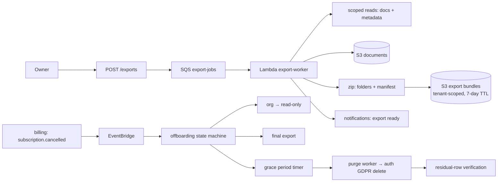

# Design — ai-data-room / data-export

**Status:** draft
**Requirements:** [./requirements.md](./requirements.md)
**Last updated:** 2026-05-31
**Depends on:** `auth-and-orgs` (GDPR delete machinery), `room-and-folders`,
`tenant-isolation`; consumes `billing-subscription` cancellation events

## Summary

An async **export worker** assembles a per-org (or per-scope) archive — document
bytes in canonical-folder layout plus a versioned per-entity metadata manifest —
to a tenant-scoped, short-lived bundle in S3, surfaced via a short-TTL signed
URL and a `notifications` ping. A separate **offboarding state machine** reacts
to subscription cancellation: read-only → final export available → grace period
→ scheduled purge (reusing `auth-and-orgs` hard-delete), with a post-purge
**verification** that no residual rows remain.

## Slice-1 alignment

Conforms to the patterns slice 1 shipped (`auth-and-orgs` HANDOFF stickies):

- **Audit** via `safeAudit`/`recordAuditEvent` only (#13–14). Add to
  `AuditEventTypeSchema` (`application/audit.ts`): `export.requested`,
  `export.ready`, `export.downloaded`, `offboarding.started`,
  `purge.scheduled`, `purge.completed`.
- **New tables** `export_jobs`, `org_lifecycle` each need the one-line
  `EXPECTED_TABLES` update in `migrate.integration.test.ts` (#25).
- **HTTP routes** under `application/export/<route>/` (#27). Purge reuses the
  `auth-and-orgs` GDPR hard-delete; the residual-row check iterates the
  `tenant-isolation` table registry.

## Architecture

## Data model

### `export_jobs`

| Column | Type | Notes |
| --- | --- | --- |
| `id` | `uuid` PK | |
| `org_id` | `uuid` FK | tenant-scoped. |
| `requested_by` | `uuid` FK `users.id` | |
| `scope` | `enum('org','opportunity','folder')` | FR4. |
| `scope_ref` | `text` nullable | opportunity id / folder. |
| `include_versions` | `boolean` | FR5. |
| `status` | `enum('pending','running','ready','failed','expired')` | |
| `bundle_s3_key` | `text` nullable | |
| `manifest_version` | `text` | FR-NFR5. |
| `expires_at` | `timestamptz` | bundle TTL (NFR3). |
| `created_at` / `ready_at` | `timestamptz` | |

### `org_lifecycle`

| Column | Type | Notes |
| --- | --- | --- |
| `org_id` | `uuid` PK | |
| `state` | `enum('active','offboarding','purged')` | |
| `grace_until` | `timestamptz` nullable | purge schedule. |
| `final_export_job_id` | `uuid` nullable | |
| `updated_at` | `timestamptz` | |

## Export worker

1. Authorise (owner/admin; full-org requires owner).
2. Scoped reads via `tenant-isolation` factory across the entity set.
3. Stream document bytes from S3 into a zip mirroring canonical folders;
   write per-entity manifest files (`documents.json`, `checklist.json`,
   `memberships.json`, `audit.csv`, …) + a root `manifest.json` (versioned).
4. Upload the bundle to a tenant-scoped prefix with a 7-day lifecycle (NFR3).
5. Mark `ready`, emit audit + a `notifications` "export ready" event with a
   short-TTL signed download URL.

## Offboarding state machine

- `subscription.cancelled` → `org_lifecycle.state = offboarding`, org set
  read-only (enforced at the access layer), a **final export** auto-queued,
  `grace_until = now + 30d` (NFR/FR6).
- During grace: reactivation event → back to `active` (FR8).
- At `grace_until`: purge worker runs the `auth-and-orgs` hard-delete across the
  full tenant-scoped table registry, then a **verification** query confirms zero
  residual rows (FR7/NFR4); on success → `purged` + audit.

## Interfaces

| Method | Path | Purpose |
| --- | --- | --- |
| `POST` | `/exports` | Request an export (scope + options). |
| `GET` | `/exports` | List own org's export jobs + status. |
| `GET` | `/exports/:id/download` | Signed URL when `ready`. |
| `GET` | `/lifecycle` | Org lifecycle state + grace window (owner/admin). |
| `POST` | `/lifecycle/reactivate` | Reactivate during grace (owner). |

## Security

- **Owner-gated** full-org export; external users have no export path.
- **Tenant-scoped** bundles + reads (`tenant-isolation`); cross-org export
  impossible.
- **Short-TTL bundles** (NFR3) so exported sensitive data doesn't linger.
- **Verifiable purge** (NFR4) — the residual-row check is the proof the org is
  truly gone; reuses the tenant-scoped table registry as the checklist.
- **Audit everything** (FR9) — export + offboarding steps are all logged.

## Observability

- **Metrics:** `export.jobs{status}`, `export.duration_ms`, `export.bundle_bytes`,
  `offboarding.purges{outcome}`, `offboarding.residual_rows` (must be 0).
- **Alerts:** `offboarding.residual_rows > 0` (a purge that didn't fully clean →
  P1); `export.jobs failed` spike.
- **Logs:** `orgId, scope, status, durationMs, bundleBytes`.

## Key trade-offs

- **Reuse the GDPR hard-delete + tenant registry for purge.** One deletion path,
  one source of truth for "what belongs to an org"; the registry doubles as the
  verification checklist.
- **Bundle to S3 with a TTL over streaming on-demand.** Large exports are slow;
  async + notify + short-lived bundle is safer and simpler than long-held
  connections, and the TTL bounds data exposure.
- **Grace-period offboarding over immediate purge.** Protects against accidental
  cancellation and satisfies "give me my data before you delete it."

## Open questions

- Per-entity manifest files vs. one JSON (leaning per-entity + index).
- Grace length / plan-dependence — confirm with `billing-subscription`.
- Whether the audit log export here supersedes `admin-dashboard`'s CSV export or
  complements it (leaning: admin CSV is the live view; this is the archival
  bundle).

## Sign-off

- [ ] Bradley reviewed
- [ ] Tasks phase unblocked
