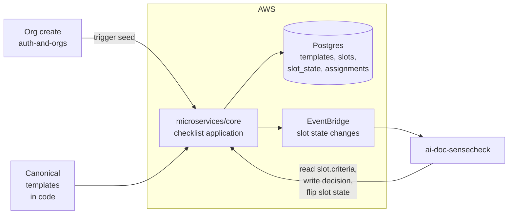

# Design — ai-data-room / doc-checklist

**Status:** draft
**Requirements:** [./requirements.md](./requirements.md)
**Last updated:** 2026-04-21
**Depends on:** `room-and-folders`

## Summary

Canonical templates live **in code** (one TypeScript module per
canonical folder + Opportunity default). On org creation, the code
templates are **snapshotted** into per-org template rows. Admins edit
the snapshot, not the canonical — no shared-template drift across
orgs. Each slot tracks its state machine (`empty` → `uploaded` →
`approved|rejected|not_applicable`) in its own row; completion is a
direct SQL aggregate. Uploaded documents reference their target slot
via a nullable FK from `document_versions`. The `ai-doc-sensecheck`
slice reads the slot's `criteria` field from this slice — that's the
only cross-slice coupling.

## Architecture



## Data model

### `checklist_templates`

Per-org snapshot of a canonical or Opportunity-default template.

| Column                      | Type                                      | Notes                                                |
| --------------------------- | ----------------------------------------- | ---------------------------------------------------- |
| `id`                        | `uuid` PK                                 |                                                      |
| `org_id`                    | `uuid` FK                                 |                                                      |
| `scope`                     | `enum('canonical','opportunity_default')` |                                                      |
| `canonical_folder`          | `text` nullable                           | One of `CANONICAL_FOLDERS` when `scope='canonical'`. |
| `name`                      | `text`                                    | "02_Financials" / "Vendor Onboarding (default)"      |
| `description`               | `text` nullable                           |                                                      |
| `created_at` / `updated_at` | `timestamptz`                             |                                                      |

Unique: `(org_id, scope, canonical_folder)` where `canonical_folder is not null`; plus a per-org singleton row for `opportunity_default`.

### `checklist_slots`

Individual slots within a template. Also used for per-Opportunity
instances (see `checklist_slot_instances`).

| Column                      | Type                               | Notes                                                                                                                        |
| --------------------------- | ---------------------------------- | ---------------------------------------------------------------------------------------------------------------------------- |
| `id`                        | `uuid` PK                          |                                                                                                                              |
| `template_id`               | `uuid` FK `checklist_templates.id` |                                                                                                                              |
| `slot_key`                  | `text`                             | Stable identifier within template, e.g. `articles_of_association`.                                                           |
| `title`                     | `text`                             | Display title.                                                                                                               |
| `description`               | `text`                             |                                                                                                                              |
| `guidance_markdown`         | `text` nullable                    | Rich guidance for AI + uploader.                                                                                             |
| `required`                  | `boolean` default true             |                                                                                                                              |
| `expected_file_types`       | `text[]`                           | MIME subset or `['*']`.                                                                                                      |
| `criteria`                  | `jsonb`                            | Structured: `{ must_include: string[], must_not_include: string[], plain_language: string }`. Consumed by ai-doc-sensecheck. |
| `display_order`             | `int`                              | For UI ordering.                                                                                                             |
| `hidden`                    | `boolean` default false            | Admin hide without delete.                                                                                                   |
| `created_at` / `updated_at` | `timestamptz`                      |                                                                                                                              |

Unique: `(template_id, slot_key)`.

### `checklist_slot_instances`

A concrete instance of a slot attached to a folder or Opportunity
subroom. Canonical folders get one row per slot per org. Opportunity
subrooms get one row per slot per subroom, cloned from the
Opportunity-default template at subroom-create time.

| Column                      | Type                                                                              | Notes                    |
| --------------------------- | --------------------------------------------------------------------------------- | ------------------------ |
| `id`                        | `uuid` PK                                                                         |                          |
| `org_id`                    | `uuid` FK                                                                         |                          |
| `slot_id`                   | `uuid` FK `checklist_slots.id`                                                    |                          |
| `folder_kind`               | `enum('canonical','opportunity')`                                                 |                          |
| `canonical_folder`          | `text` nullable                                                                   | XOR w/ `opportunity_id`. |
| `opportunity_id`            | `uuid` nullable FK                                                                |                          |
| `state`                     | `enum('empty','uploaded','approved','rejected','not_applicable')` default `empty` |                          |
| `na_reason`                 | `text` nullable                                                                   |                          |
| `assigned_document_id`      | `uuid` nullable FK `documents.id`                                                 |                          |
| `last_transitioned_by`      | `uuid` nullable FK `users.id`                                                     |                          |
| `last_transitioned_at`      | `timestamptz` nullable                                                            |                          |
| `created_at` / `updated_at` | `timestamptz`                                                                     |                          |

Unique: `(org_id, folder_kind, canonical_folder, opportunity_id, slot_id)` — one instance per slot per location.

Index: `(org_id, folder_kind, canonical_folder, state)` for completion queries.

### Add column to `document_versions` (from room-and-folders)

| Column                      | Type                                             | Notes                                                                                  |
| --------------------------- | ------------------------------------------------ | -------------------------------------------------------------------------------------- |
| `assigned_slot_instance_id` | `uuid` nullable FK `checklist_slot_instances.id` | Set at upload-complete when the uploader picks a slot. Null for uncategorised uploads. |

## Canonical templates as code

```
microservices/core/domain/checklist/templates/
  01_company_overview.ts
  02_financials.ts
  03_commercial.ts
  04_product.ts
  05_legal.ts
  06_operations.ts
  opportunity_default.ts
  index.ts   // exports the array
```

Each template is a typed const:

```ts
export const Financials: TemplateDefinition = {
  canonicalFolder: "02_Financials",
  name: "02_Financials",
  slots: [
    {
      slotKey: "latest_audited_accounts",
      title: "Latest audited accounts",
      description: "Most recent signed audited financial statements.",
      guidanceMarkdown: "…",
      required: true,
      expectedFileTypes: ["application/pdf"],
      criteria: {
        mustInclude: ["balance sheet", "auditor report"],
        mustNotInclude: [],
        plainLanguage:
          "A set of signed audited financial statements for the latest financial year.",
      },
    },
    // …
  ],
};
```

Canonical content (exact wording, exact slots) is finalised with
**Curtis** during the build of this slice. Design contract: each
slot must have a `plainLanguage` field — that's the one
`ai-doc-sensecheck` leans on.

## Lifecycle

### On org creation

1. For each canonical template, insert a `checklist_templates` row.
2. For each slot in that template, insert a `checklist_slots` row.
3. For each slot, insert a `checklist_slot_instances` row for the
   matching canonical folder with `state='empty'`.

All in a single transaction. Runs synchronously inside
`auth-and-orgs`'s signup handler — org create + checklist seed is
atomic.

### On Opportunity subroom creation

Within `room-and-folders`'s `createOpportunity`:

1. Clone the org's `opportunity_default` template's slots into
   `checklist_slot_instances` rows scoped to this subroom.

### On document upload complete

Within `room-and-folders`'s `completeUpload`:

1. If the uploader chose a slot, set
   `document_versions.assigned_slot_instance_id` AND
   `checklist_slot_instances.assigned_document_id` +
   `state='uploaded'`.
2. Emit `slot.uploaded` event for `ai-doc-sensecheck`.

### On admin action

Approve / reject / mark N/A / clear N/A — application-layer methods
that flip `state`, audit-log, and (for reject) also set
`assigned_document_id = null` and emit an event the UI consumes.

### On document soft-delete

Revert the slot to `empty` and clear `assigned_document_id`. Audit
event: `slot_reset_by_document_delete`.

## Completion computation

```sql
SELECT
  SUM(
    CASE WHEN s.required AND csi.state != 'not_applicable'
    THEN 1 ELSE 0 END
  ) AS total_required,
  SUM(
    CASE WHEN s.required
      AND csi.state = 'approved'
    THEN 1 ELSE 0 END
  ) AS completed_required
FROM checklist_slot_instances csi
JOIN checklist_slots s ON s.id = csi.slot_id
WHERE csi.org_id = $1
  AND csi.folder_kind = 'canonical'
  AND csi.canonical_folder = $2;
```

Covered by a composite index on
`(org_id, folder_kind, canonical_folder, state)`; returns in ≤100ms
for folders up to 50 slots (NFR1).

Room-level roll-up = sum over all folders + all non-archived
Opportunities.

## Interfaces

All under `/orgs/:orgId/`. All behind `requires(...)` from
`access-control`.

| Method  | Path                            | Purpose                                                        |
| ------- | ------------------------------- | -------------------------------------------------------------- |
| `GET`   | `/folders/:canonical/checklist` | Get template + slot states for a canonical folder.             |
| `GET`   | `/opportunities/:id/checklist`  | Same, for an Opportunity subroom.                              |
| `POST`  | `/slots/:instanceId/approve`    | Admin approval.                                                |
| `POST`  | `/slots/:instanceId/reject`     | Admin reject (body: `{ reason }`).                             |
| `POST`  | `/slots/:instanceId/mark-na`    | Mark N/A (body: `{ reason }`).                                 |
| `POST`  | `/slots/:instanceId/clear-na`   | Clear N/A.                                                     |
| `POST`  | `/slots/:instanceId/reset`      | Return to empty (owner/editor only).                           |
| `PATCH` | `/templates/:id/slots/:slotId`  | Admin edit (title, criteria, required, hidden, display_order). |
| `POST`  | `/templates/:id/slots`          | Admin add custom slot.                                         |
| `GET`   | `/rooms/:orgId/completion`      | Aggregated completion (home widget).                           |

## Key trade-offs

- **Templates in code, snapshotted per-org** — chose snapshot over
  live-reference because FR4 requires per-org customisation without
  affecting the canonical set. A live reference would either forbid
  customisation or require fork-on-write (same as snapshot, more
  complexity). → [ADR-006](../../../adr/006-template-snapshot-per-org.md) _(to be drafted)_

- **Slot instances rows vs. computed-on-read** — chose rows because
  (a) each slot carries independent state and history; (b)
  append-only auditing of state transitions needs a stable id;
  (c) query cost is O(slots-in-folder) with a good index.

- **`assigned_slot_instance_id` on `document_versions` vs. on
  `documents`** — chose `document_versions` because a subsequent
  upload of the same doc can legitimately hit a different slot
  (e.g. "latest accounts 2024" → "latest accounts 2025"). Versioning
  the slot-assignment matches the versioning of the document itself.

- **Curtis-driven content in design phase not requirements** —
  keeps requirements shippable without SME availability; design
  phase is where concrete slot lists get nailed.

## Security

Templates and slots are per-org; cross-tenant reads denied by
`requires(...)`. `criteria.plainLanguage` is passed to
`ai-doc-sensecheck`, which passes it to Anthropic. Admin edits to
criteria are logged as audit events.

## Observability

Logs: every state transition with `orgId`, `slotInstanceId`,
`from → to`, `actorUserId`, `reason?`.

Metrics:

- `checklist.slot.transition{from,to}` — count.
- `checklist.folder.completion_pct` — gauge (per-org, per-folder,
  daily).
- `checklist.template.custom_slot_count` — gauge.

Alerts: none at v0.1 — no operational urgency here; rely on Q&A and
auth signals for incidents.

## Rollout

Migrations: `checklist_templates` → `checklist_slots` →
`checklist_slot_instances` → add column to `document_versions`.
Backfill: for any existing orgs (dev/staging only pre-launch),
seed their canonical templates via a migration-time script.

Feature flag: `checklist_enabled` per-org. Disabled means checklist
UI hidden and uploads skip the slot-assignment step. Flipped on by
default in prod.

## Open questions

- **`opportunity_default` template variations per "mode"** (RFP,
  M&A, vendor) — at v0.1 only one default; Phase 2 introduces modes.
  Leaning **single default** at v0.1; add a `mode` column in a
  future migration.
- Do we persist **per-slot history** (who approved, when, previous
  decisions)? Audit events cover this — a dedicated `slot_history`
  table would be convenient but duplicative. Leaning **no dedicated
  table**; derive from audit events when the admin UI needs it.
- **Uncategorised uploads** — exposed in folder listing alongside
  categorised ones, or segregated? Leaning **segregated** — an
  "Uncategorised" section at the bottom of each folder view makes
  the expected checklist structure the default experience.

## Sign-off

- [ ] Bradley reviewed
- [ ] Tasks phase unblocked
