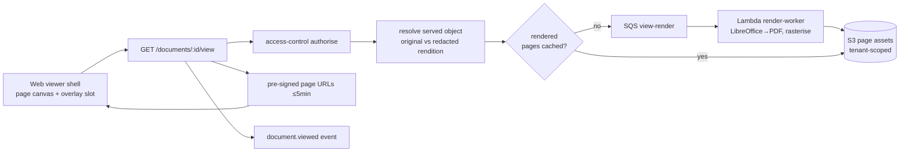

# Design — ai-data-room / document-viewer

**Status:** draft
**Requirements:** [./requirements.md](./requirements.md)
**Last updated:** 2026-05-31
**Depends on:** `room-and-folders`, `access-control`, `tenant-isolation`

## Summary

A read-only viewer built on **server-rendered page images + a thin client
shell**. Office formats convert to PDF in a worker; PDFs rasterise to per-page
images (or stream via a PDF.js-style canvas for native PDFs). Every view is
authorised by `access-control` and served via short-TTL pre-signed URLs. The
client exposes an **overlay slot** so `document-redaction` (region drawing) and
`ai-search-qna` (citation highlight) compose on top without forking. The
page-image step is the deliberate future insertion point for watermarking.

## Slice-1 alignment

Conforms to the patterns slice 1 shipped (`auth-and-orgs` HANDOFF stickies):

- **Audit** via `safeAudit`/`recordAuditEvent` only (#13–14). Add `document.viewed`
  to `AuditEventTypeSchema` (`application/audit.ts`).
- **New table** `document_renders` needs the one-line `EXPECTED_TABLES` update in
  `migrate.integration.test.ts` (#25).
- **HTTP routes** under `application/viewer/<route>/` (#27). Tables + page assets
  scoped via the `tenant-isolation` factory. Source-IP in any emitted audit uses
  the XFF-rightmost extractor (matches slice 1).

## Architecture

## Data model

### `document_renders`

Cache of rendered page assets per document version (and per rendition for
redaction-scoped serving).

| Column | Type | Notes |
| --- | --- | --- |
| `id` | `uuid` PK | |
| `org_id` | `uuid` FK | tenant-scoped. |
| `document_id` | `uuid` FK | |
| `source_kind` | `enum('original','rendition')` | which artifact was rendered. |
| `source_id` | `uuid` | `document_version_id` or `rendition_id`. |
| `page_count` | `int` | |
| `page_dims` | `jsonb` | `[{page, w, h}]` — for region anchoring (FR2). |
| `s3_prefix` | `text` | private; pages under `…/p{n}.png`. |
| `status` | `enum('pending','ready','failed')` | |
| `created_at` | `timestamptz` | |

Index `(document_id, source_kind, source_id)` — one render per artifact.

## Render pipeline

1. Authorise + resolve the served object (original vs. redacted rendition via
   `document-redaction`'s resolver).
2. If no `ready` render exists, enqueue a render job; return `pending`.
3. Worker: Office→PDF via headless LibreOffice (in-VPC, no third-party egress);
   rasterise pages to images at display DPI; write `document_renders` +
   `page_dims`.
4. Subsequent views serve cached page assets via pre-signed URLs.
5. Invalidate on new `document_version` or new rendition.

## Interfaces

All under `/orgs/:orgId/documents/:documentId`, behind `access-control`.

| Method | Path | Purpose |
| --- | --- | --- |
| `GET` | `/view` | Render status + page count + dims + signed page URLs. |
| `GET` | `/view/page/:n` | Signed URL for one page (lazy paging). |

The client shell is a `packages/web` component exposing
`<DocumentViewer documentId overlay={…} initialPage />`. `overlay` is the
composition slot used by redaction + Q&A.

## Security

- **Authorise every view** (FR3) — no render served without an `access-control`
  pass; redaction-scoped viewers get the rendition only.
- **View-only means no original bytes** (FR4) — the page-image path never
  exposes the source object key to a `viewer`-tier session.
- **Tenant-scoped assets** (NFR2) — `document_renders` + S3 prefixes flow
  through `tenant-isolation`.
- **Short-TTL signed URLs** (FR5), no-cache headers (NFR4).
- **Watermark insertion point** — the rasterise step is where a future
  per-viewer watermark is stamped (Phase 2).

## Observability

- **Metrics:** `viewer.render_latency_ms` (histogram), `viewer.cache_hit_rate`,
  `viewer.first_page_ms`, `viewer.render_failures`.
- **Alert:** `viewer.render_failures` spike; `first_page_ms p95 > 1500`.
- **Logs:** `documentId, sourceKind, pageCount, cacheHit, latencyMs`.

## Key trade-offs

- **Server-rendered page images over shipping originals to the browser.**
  Enables view-only without leaking bytes, gives a stable region-anchoring
  coordinate system for redaction, and is the watermark insertion point. Cost:
  render compute + storage; mitigated by caching.
- **Lazy render-with-cache over pre-render on upload.** Cheaper; first view of a
  given doc pays once. Revisit if first-view latency hurts the demo.
- **Headless LibreOffice in-VPC over a managed conversion API.** Keeps document
  bytes inside our boundary (consistent with the AI-vendor boundary stance).

## Open questions

- Native PDFs: rasterise server-side (uniform path, watermark-ready) vs. stream
  to a client PDF.js canvas (sharper, cheaper, but harder to watermark/secure).
  Leaning rasterise for uniformity at v0.1.
- Page image format/DPI trade-off (PNG vs. WebP; DPI vs. size). Resolve in T-002.

## Sign-off

- [ ] Bradley reviewed
- [ ] Tasks phase unblocked
