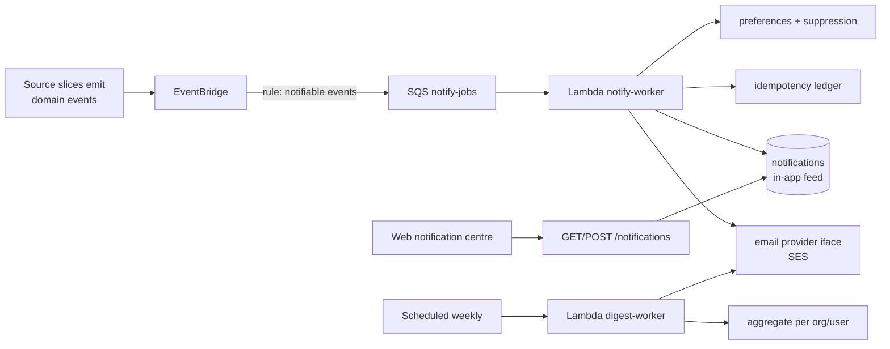

# Design — ai-data-room / notifications

**Status:** draft
**Requirements:** [./requirements.md](./requirements.md)
**Last updated:** 2026-05-31
**Depends on:** `auth-and-orgs`, `tenant-isolation`; consumes EventBridge events
from `room-and-folders`, `access-control`, `ai-doc-sensecheck`, `ai-search-qna`

## Summary

An event-driven notification service: an EventBridge rule fans matching domain
events into an SQS queue; a worker maps each to a notification category, applies
per-user preferences + suppression + idempotency, writes an in-app
notification, and (for immediate categories) sends a coalesced email through a
provider abstraction. A scheduled job builds the weekly digest. The service is
**pull, not push** — source slices keep emitting the events they already emit;
this slice subscribes. No source slice depends on notifications.

## Slice-1 alignment

Conforms to the patterns slice 1 shipped (`auth-and-orgs` HANDOFF stickies):

- **Subscribes** to existing domain events (it adds no new `AuditEventTypeSchema`
  entries) — but its own admin-relevant actions (e.g. preference change) that
  warrant audit go through `safeAudit`/`recordAuditEvent` (#13–14), never
  `AuditRepo.write`. Notification _sends_ are logged separately (not audit).
- **New tables** `notifications`, `notification_preferences`,
  `notification_sends`, `email_suppressions` each need the one-line
  `EXPECTED_TABLES` update in `migrate.integration.test.ts` (#25).
- **HTTP routes** under `application/notifications/<route>/` (#27);
  `handlers/` stays webhook-only. Tables scoped via the `tenant-isolation`
  factory; the digest worker uses the scheduled-task pattern.

## Architecture

## Data model

### `notifications` (in-app feed)

| Column       | Type                                                     | Notes                          |
| ------------ | -------------------------------------------------------- | ------------------------------ |
| `id`         | `uuid` PK                                                |                                |
| `org_id`     | `uuid` FK                                                | tenant-scoped.                 |
| `user_id`    | `uuid` FK                                                | recipient.                     |
| `category`   | `enum('access','ai','checklist','membership','billing')` |                                |
| `event_type` | `text`                                                   | source event name.             |
| `payload`    | `jsonb`                                                  | title, body, deep-link target. |
| `read_at`    | `timestamptz` nullable                                   |                                |
| `created_at` | `timestamptz`                                            |                                |

Index `(user_id, created_at)` for feed; partial `(user_id) WHERE read_at IS NULL`
for unread badge.

### `notification_preferences`

| Column           | Type                               | Notes         |
| ---------------- | ---------------------------------- | ------------- |
| `user_id`        | `uuid` PK part                     |               |
| `category`       | enum PK part                       |               |
| `channel_policy` | `enum('immediate','digest','off')` | per category. |
| `updated_at`     | `timestamptz`                      |               |

### `notification_sends` (idempotency + outcome)

| Column     | Type                                             | Notes            |
| ---------- | ------------------------------------------------ | ---------------- |
| `event_id` | `text` PK part                                   | source event id. |
| `user_id`  | `uuid` PK part                                   |                  |
| `channel`  | `enum('inapp','email')` PK part                  |                  |
| `outcome`  | `enum('sent','suppressed','coalesced','failed')` |                  |
| `sent_at`  | `timestamptz`                                    |                  |

### `email_suppressions`

`(email, reason enum('unsubscribe','bounce','complaint'), created_at)` — checked
before every non-transactional send (FR8).

## Event → category map

A code table (versioned, like the qna prompts) maps event names to categories +
default policy. Unknown events are ignored (logged), never sent. Examples:
`document.downloaded`→access/immediate, `nda.signed`→access/immediate,
`slot.flagged`→ai/digest, `grant.expiring`→access/immediate,
`invitation.expiring`→membership/immediate, `qna.flagged`→ai/digest.

## Delivery logic (notify-worker)

1. Resolve recipients for the event's org (owner/admins by default; category-
   dependent).
2. For each recipient × channel: check `notification_sends` (idempotency),
   preferences, suppression.
3. Always write the in-app `notifications` row (unless category=off).
4. For `immediate` email: coalesce — if a send to this user occurred within the
   coalesce window, batch into a pending "bundle" rather than a second email.
5. Record outcome in `notification_sends`.

## Weekly digest (digest-worker)

Scheduled per org (org-local Monday 08:00 at v0.1). Aggregates the period's
events per user, renders the `datum/room` digest template (activity counts, top
AI flags, expiring items), sends via the provider. Idempotent per period (FR9/
NFR4); skips users with zero relevant activity (no empty digests).

## Interfaces

| Method | Path                                | Purpose                                   |
| ------ | ----------------------------------- | ----------------------------------------- |
| `GET`  | `/notifications`                    | Paged in-app feed (own).                  |
| `POST` | `/notifications/read`               | Mark one/all read.                        |
| `GET`  | `/notifications/preferences`        | Read prefs.                               |
| `PUT`  | `/notifications/preferences`        | Update prefs.                             |
| `GET`  | `/notifications/unsubscribe/:token` | One-click manage/suppress (signed token). |

## Security

- **Tenant isolation** — all tables scoped via `tenant-isolation`; a user only
  ever sees their own org's events.
- **Suppression is absolute** (FR8) — checked before every non-transactional
  send; preferences cannot override it.
- **Signed unsubscribe tokens** — no auth required to unsubscribe, but the token
  is signed + scoped to the user/email.
- **PII** — email bodies + logs follow `auth-and-orgs` NFR8 redaction rules.

## Observability

- **Metrics:** `notify.sent{channel,category}`, `notify.coalesced`,
  `notify.suppressed`, `notify.latency_ms` (event→send), `digest.sent`,
  `email.bounce_rate`.
- **Alerts:** `notify.latency_ms p95 > 120s`; `email.bounce_rate` spike.
- **Logs:** `eventId, userId, category, channel, outcome`.

## Key trade-offs

- **Pull/subscribe over source slices calling us.** Keeps notifications a leaf
  dependency — source slices never import it, so it can ship mid-stream without
  reworking earlier slices.
- **SES behind an interface over a managed provider.** In-stack + cheap; the
  interface allows a later swap if deliverability needs managed reputation.
- **Coalescing immediate email.** Protects users from event storms (bulk
  download) while preserving the in-app feed's granularity.

## Open questions

- Coalesce window length (5 vs. 15 min) — tune against real event volume.
- Should the in-app feed reuse the audit-event store or stay separate? Leaning
  separate (read/unread + per-user fan-out differ from the append-only audit
  log).

## Sign-off

- [ ] Bradley reviewed
- [ ] Tasks phase unblocked
