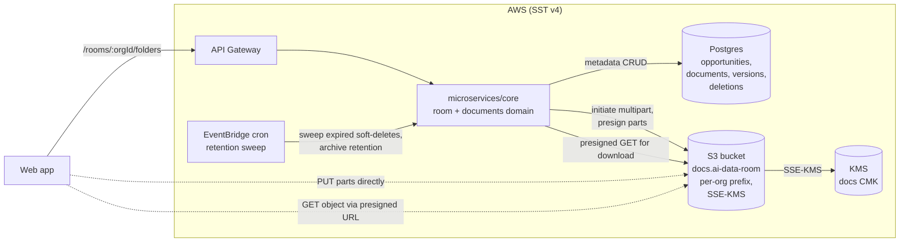

# Design — ai-data-room / room-and-folders

**Status:** draft
**Requirements:** [./requirements.md](./requirements.md)
**Last updated:** 2026-04-21
**Depends on:** `auth-and-orgs` design

## Summary
Room structure is **virtual, stored in Postgres**; the six canonical
folders are implicit (constant enum, no DB rows) and the
`Opportunities/*` subrooms are DB rows. Document bytes live in **S3**
under a per-org prefix, encrypted with a KMS customer-managed key.
Document **metadata + versions** live in Postgres so we can query,
audit, and integrate with `doc-checklist` and `ai-search-qna` without
scanning S3. Uploads use **S3 multipart resumable** via pre-signed
URLs; downloads use **short-TTL pre-signed URLs** scoped to the
requesting session. Access scoping is delegated entirely to
`access-control` — this slice exposes primitives and trusts the
middleware.

## Architecture



### Boundary with earlier slices
- **auth-and-orgs** owns `organizations`, `users`, `org_memberships`,
  `external_access_grants`. We reference by FK.
- **access-control** owns the middleware that decides whether the
  caller may hit a folder/document endpoint. This slice's handlers
  **always** run through the enforcement middleware; they do not
  contain role checks of their own beyond trivial "is there a
  session".

## Data model

### `opportunities`
Represents an Opportunity subroom under `Opportunities/`.

| Column | Type | Notes |
|---|---|---|
| `id` | `uuid` PK | |
| `org_id` | `uuid` FK `organizations.id` | |
| `slug` | `text` | e.g. `Vendor_A`. Unique per org; 1–64 chars; `[A-Za-z0-9_\-]+`. |
| `name` | `text` | Display name; defaults to slug. |
| `status` | `enum('active','archived')` | See FR6. |
| `archived_at` | `timestamptz` nullable | When archived; triggers retention timer. |
| `created_by` | `uuid` FK `users.id` | |
| `created_at` / `updated_at` | `timestamptz` | |

Unique index: `(org_id, slug)`.
Partial index: `where status='active'` for fast nav queries.

### Canonical folders — **not a DB table**
The six canonical folders are a **const enum** in code:
```ts
export const CANONICAL_FOLDERS = [
  '01_Company_Overview',
  '02_Financials',
  '03_Commercial',
  '04_Product',
  '05_Legal',
  '06_Operations',
] as const;
export type CanonicalFolder = typeof CANONICAL_FOLDERS[number];
```
No per-org rows. Rationale: FR2 says they're immutable and identical
for every org; a DB row per org per folder buys us nothing.

### Folder path (conceptual)
A document's folder path is one of:
- a `CanonicalFolder` string (e.g. `02_Financials`), or
- `Opportunities/<opportunity_slug>` derived from `opportunities.slug`.

Represented in the `documents` table as two columns (see below) — not
as a flat string — to keep integrity on rename.

### `documents`
A logical document. Has one or more versions.

| Column | Type | Notes |
|---|---|---|
| `id` | `uuid` PK | |
| `org_id` | `uuid` FK | |
| `folder_kind` | `enum('canonical','opportunity')` | |
| `canonical_folder` | `text` nullable | One of `CANONICAL_FOLDERS`; null when `folder_kind='opportunity'`. Constraint enforces XOR with `opportunity_id`. |
| `opportunity_id` | `uuid` nullable FK `opportunities.id` | |
| `display_name` | `text` | Canonical "filename" seen in UI; initialised from first upload's original filename. |
| `current_version_id` | `uuid` nullable FK `document_versions.id` | Fast lookup; denormalised for listing speed. |
| `state` | `enum('active','soft_deleted','hard_deleted')` | |
| `soft_deleted_at` | `timestamptz` nullable | Starts the 30-day retention clock. |
| `created_by` | `uuid` FK `users.id` | |
| `created_at` / `updated_at` | `timestamptz` | |

CHECK constraint: exactly one of `(canonical_folder, opportunity_id)`
non-null, matching `folder_kind`.
Index: `(org_id, folder_kind, canonical_folder, state)` and
`(org_id, opportunity_id, state)` for listing.

### `document_versions`
Each upload creates a new version, even for name collisions.

| Column | Type | Notes |
|---|---|---|
| `id` | `uuid` PK | |
| `document_id` | `uuid` FK `documents.id` | |
| `version_number` | `int` | Starts at 1; monotonically increasing per document. |
| `original_filename` | `text` | As provided by the uploader. |
| `mime_type` | `text` | |
| `size_bytes` | `bigint` | |
| `sha256` | `bytea` | Computed server-side on completion. |
| `s3_key` | `text` | Full S3 key (see §Storage layout). |
| `s3_version_id` | `text` nullable | S3 object version id (we also enable S3 versioning — belt and braces for recovery). |
| `uploaded_by` | `uuid` FK `users.id` | |
| `uploaded_at` | `timestamptz` | |

Unique: `(document_id, version_number)`.

### `document_deletions`
Audit-adjacent record retained post-hard-delete; enables
forensic reconstruction without PII leakage (no filenames stored here).

| Column | Type | Notes |
|---|---|---|
| `id` | `uuid` PK | |
| `document_id` | `uuid` | FK no longer valid after hard-delete. |
| `org_id` | `uuid` | |
| `soft_deleted_by` | `uuid` FK `users.id` | |
| `hard_deleted_at` | `timestamptz` | |

## Storage layout (S3)

One bucket per environment (`aidr-docs-dev`, `aidr-docs-staging`,
`aidr-docs-prod`). Object key:

```
orgs/<org_id>/documents/<document_id>/<version_id>
```

No original filename in the key — prevents accidental leakage if an
object URL is sniffed; maintains same prefix regardless of rename.

Bucket settings:
- **Blocked** to all public access.
- **SSE-KMS** with a dedicated customer-managed key for the docs
  bucket.
- **Versioning enabled** (defence-in-depth for accidental overwrite;
  our version model is authoritative, but S3 versioning is cheap
  insurance).
- **Lifecycle rule**: objects with tag `state=hard-deleted` transition
  to deletion after 7 days of grace (internal ops buffer, not a
  user-facing retention).
- **Object Lock**: off at v0.1; enable when SOC 2 scope begins
  (NFR10 from `auth-and-orgs`).

## Upload pipeline (multipart + resumable)

```
Client                        Core API                        S3
  │                              │                              │
  │ POST /uploads/initiate        │                              │
  │   (folder, filename, size,   │                              │
  │    mimeType)                 │                              │
  ├─────────────────────────────►│                              │
  │                              │ validate (type, size)         │
  │                              │ create `documents` row (state=draft), │
  │                              │ create `document_versions` row,       │
  │                              │ create S3 multipart upload,           │
  │                              │ presign part URLs                     │
  │                              ├─────────────────────────────►│
  │                              │◄────upload_id + part URLs────│
  │◄─────upload_id + URLs────────│                              │
  │                              │                              │
  │ PUT part 1..N                │                              │
  ├─────────────────────────────────────────────────────────────►│
  │◄────ETags──────────────────────────────────────────────────│
  │                              │                              │
  │ POST /uploads/complete        │                              │
  │   (upload_id, parts[])       │                              │
  ├─────────────────────────────►│                              │
  │                              │ complete S3 multipart         │
  │                              ├─────────────────────────────►│
  │                              │ compute sha256 via HEAD / copy│
  │                              │ set documents.state='active', │
  │                              │   current_version_id,         │
  │                              │   write audit event           │
  │◄────document_id, version─────│                              │
```

**Why multipart for everything**: simpler code path, resumable for
larger files (FR11), identical client SDK regardless of size. Part
size threshold for multipart-in-SDK is `@aws-sdk/lib-storage` default
(5 MB).

**State during upload**: `documents.state='draft'` until complete;
draft rows aren't returned by listings. A janitor job sweeps drafts
older than 24 hours (S3 multipart auto-abort at 7 days is a safety
net, but we want the DB state clean sooner).

## Download pipeline

- `GET /documents/:id` returns metadata + a **pre-signed GET URL**
  (TTL 5 min, FR16).
- The URL points at the S3 object for `current_version_id` by
  default; a `?versionId=` query param on our API selects a specific
  version (subject to `access-control`).
- Pre-signed URL generation happens **inside** the handler after
  access-control middleware has approved the request.
- `access-control` FR12 adds grant-id tracking + re-validation; that
  happens via a short-lived signed-claim token the URL carries — we
  prepend a **lambda edge / custom origin** redirector that validates
  the grant is still active before 302'ing to the S3 signed URL.
  (See `access-control`'s design for the full revalidation flow.)

## Interfaces

All paths under `/orgs/:orgId/`. Every handler runs access-control
middleware before any domain logic.

### Rooms
| Method | Path | Purpose |
|---|---|---|
| `GET` | `/rooms` | Returns canonical folders + opportunities list for the org. |
| `GET` | `/rooms/folders/:canonical` | List documents in a canonical folder. |

### Opportunities
| Method | Path | Purpose |
|---|---|---|
| `POST` | `/opportunities` | Create subroom. Body: `{ slug, name? }`. |
| `GET` | `/opportunities` | List subrooms (scoped by caller). |
| `GET` | `/opportunities/:id/documents` | List documents in subroom. |
| `PATCH` | `/opportunities/:id` | Rename (slug + name). |
| `POST` | `/opportunities/:id/archive` | Archive (triggers retention). |

### Documents — metadata
| Method | Path | Purpose |
|---|---|---|
| `GET` | `/documents/:id` | Metadata + pre-signed download URL (current version). |
| `GET` | `/documents/:id/versions` | Version history. |
| `DELETE` | `/documents/:id` | Soft delete. |
| `POST` | `/documents/:id/restore` | Restore within 30d window. |

### Documents — upload
| Method | Path | Purpose |
|---|---|---|
| `POST` | `/uploads/initiate` | Start multipart; returns `upload_id`, `document_id`, part URLs. |
| `POST` | `/uploads/:uploadId/complete` | Finalise; body: `{ parts: [{ partNumber, eTag }] }`. |
| `DELETE` | `/uploads/:uploadId` | Abort (client-cancelled). |

### Zod shapes (abridged)

```ts
const UploadInitiate = z.object({
  target: z.discriminatedUnion('kind', [
    z.object({ kind: z.literal('canonical'), folder: CanonicalFolderSchema }),
    z.object({ kind: z.literal('opportunity'), opportunityId: z.string().uuid() }),
  ]),
  filename: z.string().min(1).max(255),
  mimeType: MimeTypeEnum,
  sizeBytes: z.number().int().positive().max(100 * 1024 * 1024),
});

const DocumentDTO = z.object({
  id: z.string().uuid(),
  displayName: z.string(),
  folder: FolderPathSchema,
  currentVersion: DocumentVersionDTO,
  state: z.enum(['active','soft_deleted']),
  createdAt: z.string(),
});
```

## Key trade-offs

- **Virtual canonical folders vs. per-org folder rows** — chose
  virtual because FR2 says they're immutable and identical across
  orgs. Simpler data model, zero join cost on listings, no risk of
  orgs drifting away from the canonical structure. → [ADR-003](../../../adr/003-canonical-folders-as-code.md) *(to be drafted)*

- **S3 with SSE-KMS + versioning vs. encrypted blobs in Postgres** —
  chose S3 because document sizes (up to 100 MB) blow Postgres row
  budgets and the AWS encryption tooling is battle-tested. Postgres
  holds metadata only. Versioning in our DB is authoritative; S3
  versioning is defence-in-depth.

- **Mandatory multipart for all uploads vs. small-file shortcut** —
  chose always-multipart because the code path is identical and we
  get resumability for free. Cost: a few extra S3 API calls for tiny
  files — negligible.

- **Soft-delete retention 30 days for documents** — balances "oops
  recovery" against storage cost. Matches the common SaaS pattern
  (Dropbox, Google Drive both use similar windows).

- **Opportunity archive retention 90 days** (requirements' open
  question) — matches fintech-friendly retention norms. Longer than
  document soft-delete because archives can represent an entire
  diligence engagement whose reactivation matters more.

## Security

### Threat model (this slice)
| Threat | Mitigation |
|---|---|
| Object URL leakage → unauthorised download | Short-TTL (5 min) pre-signed URLs; access-control revalidator fronts them (see `access-control` design); no public bucket policy |
| Cross-tenant read via object key guessing | Per-org prefix isolation + IAM bucket policy scoping; orgs cannot enumerate or fetch outside their prefix |
| Malicious upload content (malware) | **Not mitigated at v0.1 — virus scan deferred (NFR5).** Bucket prefix is not public; docs served via pre-signed URLs to authenticated users; future ClamAV path preserved |
| Path traversal via folder parameter | Folder parameter validated against the CANONICAL_FOLDERS enum or an opportunity UUID — no free-form paths ever touch S3 keys |
| Checksum-based deduplication leaking existence of another org's doc | sha256 is only compared within `(org_id, document_id)` — never cross-org |
| Draft / abandoned uploads consuming KMS calls + storage | 24h janitor + S3 multipart auto-abort at 7d |

### PII in metadata
`display_name` and `original_filename` can be PII — treated as
user-authored text, redacted from logs (NFR8 in auth-and-orgs). Not
column-encrypted at v0.1 (same rationale as `auth-and-orgs` —
deferred to SOC 2 scope).

### Secrets
- S3 bucket name, KMS key id → SST stage outputs.
- S3 write/read IAM policies scoped to `orgs/*` prefix; no bucket-wide
  permissions.

## Observability

Logs:
- Every upload initiate/complete/abort with `orgId`, `userId`,
  `uploadId`, `documentId`, `sizeBytes`, `mimeType`, `durationMs`.

Metrics:
- `room.upload.initiated` / `completed` / `aborted` — count.
- `room.upload.sizeBytes` — histogram.
- `room.download.presigned.issued` — count.
- `room.download.presigned.latency` — histogram.
- `room.document.softDeleted` / `restored` / `hardDeleted` — count.
- `room.opportunity.created` / `archived` / `renamed` — count.
- `room.storage.bytes_by_org` — daily gauge (reconciliation job).

Traces: handler → DB repo calls → S3 SDK calls tagged with `orgId`.

Alerts:
- Upload completion failures >2% sustained 5 min — warn.
- Pre-signed URL issuance failures >0 — page.
- Janitor job failures — page.
- Storage cost per org > plan-defined threshold (wire later with
  `billing-subscription`).

## Rollout

Feature flag: none — this slice gates the whole product; nothing
exists before it except auth.

Migrations order: `opportunities` → `documents` → `document_versions`
→ `document_deletions`. No backfills (greenfield).

Infrastructure additions:
- S3 bucket + KMS key + IAM roles in `infra/storage.ts` (new file).
- EventBridge rule + lambda for retention sweep in
  `infra/scheduled.ts` (new file).

Rollback: migrations individually reversible. S3 bucket rollback would
be destructive and is out-of-band — we don't expect to roll this slice
back once live.

## Open questions
- Single shared docs bucket (per env) vs. bucket-per-org — shared is
  simpler and S3 prefix isolation is sufficient for correctness.
  Leaning **shared**; revisit if a large customer demands their own
  bucket for compliance.
- Should we pre-compute per-folder **document counts** on the folder
  listing endpoint? Cheap with a good index; useful UI. Leaning
  **yes** — one extra GROUP BY at list time.
- `display_name` mutability — let users rename documents in place?
  Leaning **yes** (Phase 2 in spirit, trivial to add here). Will
  require careful handling of the `current_version.original_filename`
  distinction.
- Office file preview — generate HTML previews via an in-app tool
  (e.g., `libreoffice --headless`) or rely on browser-native PDF +
  image viewing only at v0.1? Leaning **browser-native only at v0.1**;
  watermarked preview is Phase 2.

## Sign-off
- [ ] Bradley reviewed
- [ ] Tasks phase unblocked
