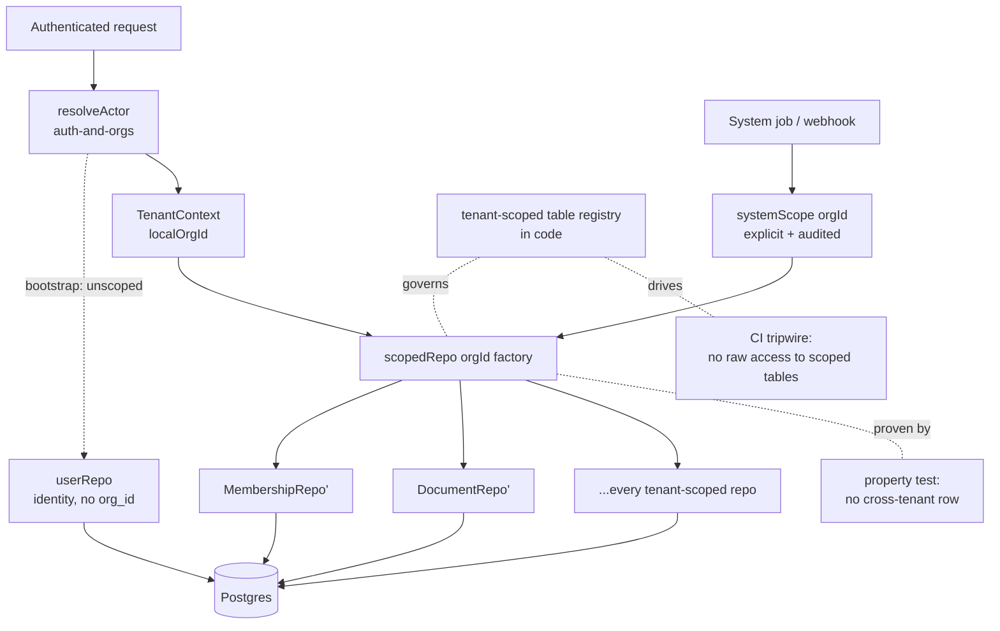

# Design — ai-data-room / tenant-isolation

**Status:** signed off (review delegated to Claude agent per Bradley, 2026-06-02)
**Requirements:** [./requirements.md](./requirements.md)
**Last updated:** 2026-06-02
**Depends on:** `auth-and-orgs`
**ADR:** [ADR-011](../../../adr/011-multi-tenant-isolation.md)

## Summary

Application-layer row-level isolation enforced through a mandatory
`scopedRepo(orgId)` factory, a code registry of tenant-scoped tables, a CI
tripwire that bans raw access to those tables, and a property test that proves
no repository method can leak cross-tenant rows. Sits beneath the role-level
checks in `access-control` and is the first filter of `ai-search-qna`'s
double access-filter. Postgres RLS (DB-enforced) is explicitly deferred to a
later hardening pass (ADR-011 Option A) — the design keeps the door open.

## Slice-1 alignment

Conforms to the patterns slice 1 shipped (`auth-and-orgs` HANDOFF stickies):

- **Audit** via `safeAudit`/`recordAuditEvent` only (#13–14). Add
  `tenancy.violation` to `AuditEventTypeSchema` (`application/audit.ts`) for the
  defence-in-depth runtime catch (FR8).
- **No new tables** — this slice _is_ the scoped-access mechanism; it backfills
  the slice-1 org-scoped repos onto the factory and provides it to all later
  slices. (Future slices' tables still each add their `EXPECTED_TABLES`
  one-liner, #25.)
- Composes with `withTx` (#15), the `findByWorkosOrgId` org-id resolution (#16),
  and is the first filter of `ai-search-qna`'s double access-filter.

## Architecture



## Mechanism

### TenantContext

A small value carrying `localOrgId: string` (our UUID, not the WorkOS text id —
cf. `auth-and-orgs` sticky on `orgRepo.findByWorkosOrgId`). Produced from the
resolved actor on every protected request and from an explicit `systemScope`
elsewhere. Never defaulted.

### `scopedRepo(orgId)` factory

The single sanctioned way to obtain a tenant-scoped repository. Conceptually:

```ts
// infrastructure/db/scoped.ts
export function scopedRepo(orgId: OrgId, db: DbOrTx = defaultDb) {
  const guard = eq(/* table */.orgId, orgId); // injected per repo
  return {
    documents: new DocumentRepo(db, orgId),   // org_id baked in
    folders:   new FolderRepo(db, orgId),
    // ...only tenant-scoped repos here
  };
}
```

Every tenant-scoped repo:

- takes `orgId` in its constructor (no default, no setter),
- injects `WHERE org_id = $orgId` into every read,
- stamps `org_id = $orgId` on every insert (and refuses a mismatched explicit
  value),
- exposes `withTx(tx)` returning a same-org instance bound to the txn
  (preserves the `auth-and-orgs` transaction pattern).

Tenant-agnostic repos (plan catalogue, `webhook_deliveries`, the dedup ledger)
are constructed normally and are **not** exported from the factory.

### Tenant-scoped table registry

A single source of truth in code. **Three buckets, not two** — the slice-1
schema audit (T-001) showed `users` is neither cleanly scoped nor agnostic:

```ts
// infrastructure/db/tenancy.ts
// Carry `org_id` directly → simple `WHERE org_id = $1` predicate.
export const TENANT_SCOPED_TABLES = [
  "org_memberships",
  "invitations",
  "external_access_grants",
  "audit_events", // org_id is NULLABLE — see note below
  "documents",
  "document_versions",
  "opportunities",
  // ...extended as each slice adds tables
] as const;
// No `org_id`; the org IS the tenant, or the row is global infra.
export const TENANT_AGNOSTIC_TABLES = [
  "orgs",
  "webhook_deliveries",
  "plan_catalogue",
] as const;
// Global identity rows with NO `org_id` column. Tenancy is the
// `org_memberships` EDGE, not a column on the row. See "Identity &
// the bootstrap path" below — `users` is NOT scoped by a predicate.
export const IDENTITY_TABLES = ["users"] as const;
```

`orgs` itself is tenant-agnostic at the row level (the org _is_ the tenant) but
lookups by id are still constrained to the caller's own org at the application
layer.

**`audit_events.org_id` is nullable** (system / no-local-actor events — e.g.
`logout` for an unprovisioned user, `recordCreateOrgFailure` with no org). The
scoped `WHERE org_id = $A` predicate therefore returns only A's rows and
correctly **excludes NULL-org rows** — those are visible only under
`systemScope`. This is intended: a NULL-org audit row belongs to no tenant.

### Identity & the bootstrap path (`users`)

`users` carries **no `org_id`** (verified against `packages/db/src/schema/auth.ts`):
a user is a global identity, and a user can have **zero** orgs — the lazy-mirror
state (`/me` → `{ orgId: null }` pre-org-creation) and external users (grants,
not memberships). So `users` cannot be scoped by a row predicate, and —
critically — `userRepo`'s identity lookups (`findByWorkosUserId`, `findById`,
`create`) run **inside `resolveActor`, before any tenant context exists**: you
need the user row to discover the org. Routing `userRepo` through
`scopedRepo(orgId)` would be a chicken-and-egg deadlock.

Resolution (matches FDP, where identity is global and tenancy is the membership
edge):

- `users` is an **identity table** — `userRepo` stays a plain, unscoped repo
  used for the pre-tenancy identity bootstrap. It is **not** exported from
  `scopedRepo`, and the CI tripwire (FR6) treats `users` as a non-scoped table.
- "The users **in** org A" is a tenant question answered by the **scoped
  `org_memberships` repo** (a join from the membership edge), not by reading
  `users` directly. Any later need to list org members goes through the scoped
  membership repo.
- `userRepo.create`/update still only ever touch the caller's own identity row
  (keyed by `workos_user_id`), so there is no cross-tenant read path through it
  — it simply isn't an org-scoped table to begin with.

### System scope

`systemScope(orgId)` constructs the same factory output but tags an audit
context `{ actor: 'system', reason: <job> }`. Retention sweeps and webhook
handlers must name the org(s) they touch; there is no "all orgs" handle.

## Enforcement

### CI tripwire (FR6)

A test in the spirit of `auth-and-orgs`' `security/__tests__/nfr-matrix.test.ts`:
greps the compiled/handler source for direct `db`/Drizzle access to any name in
`TENANT_SCOPED_TABLES` outside `infrastructure/db/scoped.ts` and the repo files
it owns. Any hit fails CI with the offending file + line. Cheap, exact, and
mirrors a pattern the team already trusts.

### Property test (NFR1, AC-US4)

Using `fast-check` (or equivalent):

1. Generate two distinct orgs A, B and a random distribution of rows across
   every tenant-scoped table.
2. For each repository method, invoke it under A's scope.
3. Assert the result set contains **zero** rows whose effective `org_id = B`.
4. Shrinking surfaces the minimal leaking case if the invariant ever breaks.

This is the load-bearing artifact of the slice and runs on every PR.

## Data model

No new tables. The slice adds:

- `infrastructure/db/scoped.ts` — the factory.
- `infrastructure/db/tenancy.ts` — the registry.
- A migration only if any existing tenant-scoped table is found to be missing
  an `org_id` (audit during T-001).

## Security

- **The invariant:** under org A's context, no query returns a row with
  `org_id ≠ A`. Enforced by the factory, guarded by the tripwire, proven by the
  property test.
- **Defence in depth:** this sits _beneath_ `access-control`'s role checks and
  is the _first_ of `ai-search-qna`'s two filters. A bug in any one layer is
  caught by another.
- **System scope is explicit:** no implicit cross-org reads; every system
  operation names its org and is audited (FR8).
- **RLS is the stronger long-term answer** (ADR-011 Option A): the registry +
  factory make a later RLS rollout mechanical — every scoped table is already
  enumerated and every access already flows through one place.

## Observability

- **Metric:** `tenancy.guard.violations` — count of runtime cross-tenant
  attempts caught by defence-in-depth (should be 0 in steady state; any spike
  is a P1).
- **Log:** on a guard catch — `orgId`, attempted `org_id`, repo method, actor.
- **Alert:** `tenancy.guard.violations > 0 over 5min` → page.

## Key trade-offs

- **Application-layer factory over Postgres RLS (chosen for v0.1).** Lower
  friction with Drizzle + PlanetScale + the `withTx` pattern + pgvector;
  ships with slice 2; same shape as FDP. Cost: enforced by discipline + tests,
  not the database. Mitigated by the tripwire + property test. RLS revisited
  before SOC 2.
- **Wrapper factory over per-method `orgId` argument.** Harder to forget; one
  place to audit; matches FDP. Cost: a small indirection on every repo
  construction.
- **Grep tripwire over a custom ESLint rule (v0.1).** Faster to ship and the
  team already trusts the NFR-matrix tripwire pattern. Revisit if false
  positives bite.

## External actors (no membership)

External users have **zero memberships** (access via `external_access_grants`,
not `org_memberships`), so `resolveActor` yields no `localOrgId` for them and
they get **no `scopedRepo` handle**. That is correct for this slice:
`external_access_grants` is a tenant-scoped table owned by the **granting** org
— internal users of org A manage org A's grants through the scoped factory. An
external actor's _own_ read path (which documents they may see, scoped to an
Opportunity) is grant-level authorisation owned by `access-control` (slice 3),
which sits _above_ this org-level isolation. This slice does not give external
actors a tenant context; it guarantees that internal org-scoped queries can't
leak across orgs.

## Open questions (resolved)

- ~~Does `audit_events` need the scoped factory, or is the append-only writer +
  cursor enough?~~ **RESOLVED:** route audit **reads** through the scoped
  factory (so an org's audit view is org-scoped); keep the canonical
  `recordAuditEvent`/`safeAudit` **writer** unchanged. NULL-org rows are
  system-only (see registry note).
- ~~Property test against real Postgres or a fake?~~ **RESOLVED: real Postgres**
  (the existing Docker-compose integration harness, port 5433) so the actual
  SQL `WHERE org_id` predicate is exercised, not a mock. T-006.
- ~~Factory shape (wrapper vs. per-method arg)?~~ **RESOLVED (requirements): a
  `scopedRepo(orgId)` wrapper** — harder to forget, one audit point, matches FDP.
- ~~Lint mechanism (ESLint rule vs. grep tripwire)?~~ **RESOLVED: grep tripwire**
  in the spirit of `security/__tests__/nfr-matrix.test.ts` for v0.1.

## Sign-off

- [x] Reviewed (delegated to Claude agent per Bradley's instruction, 2026-06-02)
- [x] Tasks phase unblocked
