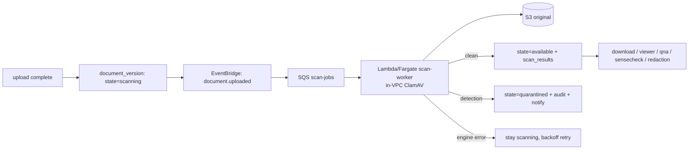

# Design — ai-data-room / virus-scanning

**Status:** draft
**Requirements:** [./requirements.md](./requirements.md)
**Last updated:** 2026-05-31
**Depends on:** `room-and-folders`, `tenant-isolation`

## Summary

Scan-on-upload with quarantine, modelled as a **document-version lifecycle
gate**. On upload-complete, a version is created in `scanning`; an async worker
(in-VPC ClamAV) scans the object and transitions it to `available` (clean) or
`quarantined` (detection), recording the verdict. Every downstream consumer
already filters to `available` versions, so a scanning/quarantined file is
simply invisible to download, viewer, Q&A, sense-check, and redaction. Scanner
errors fail closed and retry.

## Architecture

## Data model

Extends `room-and-folders`' `document_versions` rather than a new core table:

- add `scan_state enum('scanning','available','quarantined','scan_failed')`
  (default `scanning`); existing consumers gate on `available`.

### `scan_results`

| Column | Type | Notes |
| --- | --- | --- |
| `id` | `uuid` PK | |
| `org_id` | `uuid` FK | tenant-scoped. |
| `document_version_id` | `uuid` FK | |
| `verdict` | `enum('clean','infected','error')` | |
| `engine` | `text` | e.g. `clamav`. |
| `signature_version` | `text` | FR5/NFR4. |
| `detail` | `text` nullable | signature name on detection. |
| `attempt` | `int` | retry count. |
| `scanned_at` | `timestamptz` | |

## Scan worker

1. Triggered by `document.uploaded` (a new version in `scanning`).
2. Stream the object from S3 to the in-VPC ClamAV engine (freshly-updated
   signatures; report `signature_version`).
3. **clean** → `scan_state = available`, write `scan_results(clean)`, emit
   `document.scanned.clean` (this is the event `ai-search-qna` /
   `ai-doc-sensecheck` / search index should key off, not raw upload).
4. **infected** → `scan_state = quarantined`, write `scan_results(infected)`,
   emit audit + `notifications` admin alert. Object stays in place but is
   denied to all normal paths.
5. **engine error** → stay `scanning`, increment `attempt`, backoff-retry up to
   N; after N → `scan_failed` (still unavailable; admin-visible). **Never**
   auto-clean on error (FR7).

> **Pipeline note:** downstream indexing should subscribe to
> `document.scanned.clean`, not `document.uploaded`, so nothing AI-processes an
> unscanned file. This is a one-line change to the trigger in `ai-search-qna`
> T-013 / `ai-doc-sensecheck` and is called out in those slices' integration.

## Interfaces

| Method | Path | Purpose |
| --- | --- | --- |
| `GET` | `/documents/:id/scan-status` | Scan state + result for a document's versions. |
| `GET` | `/quarantine` | Admin: list quarantined versions. |
| `DELETE` | `/quarantine/:versionId` | Admin: delete a quarantined version. |

## Security

- **Clean-gate everywhere** (FR4) — consumers filter to `available`; a
  `scanning`/`quarantined`/`scan_failed` version is unreachable by download,
  viewer, Q&A, sense-check, redaction.
- **Fail closed** (FR7) — engine errors never yield `available`.
- **In-VPC scanning** (NFR2) — bytes never leave the boundary.
- **Tenant-scoped** quarantine objects + `scan_results` (`tenant-isolation`);
  quarantined bytes denied to all normal paths (NFR3).

## Observability

- **Metrics:** `scan.results{verdict}`, `scan.latency_ms`,
  `scan.backlog_age_seconds`, `scan.retries`, `quarantine.count`.
- **Alerts:** `scan.backlog_age_seconds > 300` (stuck scanner blocks the room);
  any `verdict=infected` (notify security); `scan_failed` accumulation.
- **Logs:** `documentVersionId, verdict, engine, signatureVersion, attempt`.

## Key trade-offs

- **Lifecycle gate on the version over a separate "is it clean" lookup.** One
  state field that every consumer already checks (they filter to `available`),
  so adding the gate is low-touch across slices.
- **In-VPC ClamAV over a managed service.** Keeps bytes in-boundary, EICAR-
  testable, free; cost is running + updating the engine. Revisit if detection
  quality needs a commercial engine.
- **Key indexing off `document.scanned.clean`.** Guarantees nothing AI-touches
  an unscanned file; the small cost is wiring the trigger in the AI slices.
- **Always-async with state over sync-gate for small files.** Uniform path;
  upload stays fast; the `scanning` state is the single source of truth.

## Open questions

- Worker substrate: Lambda (simple, cold-start + 100MB stream limits) vs.
  Fargate (long-running ClamAV with resident signatures). Leaning Fargate for a
  warm engine; resolve in T-002.
- Max retry attempts + backoff before `scan_failed`.
- Whether to also scan on **rendition/render** generation (no — they derive from
  already-scanned originals; non-goal).

## Sign-off

- [ ] Bradley reviewed
- [ ] Tasks phase unblocked
